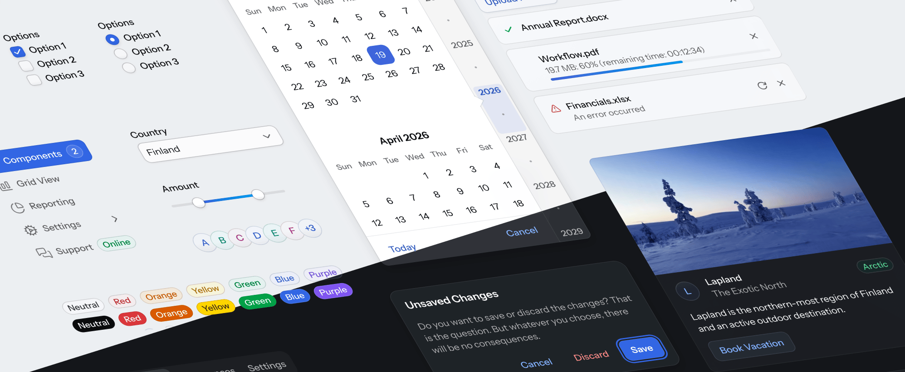

= Aura

Aura is a theme for Vaadin applications that provides default styles and variants for all official components. It defines a consistent visual system out of the box, so you don't need to build a theme from scratch.

Aura is designed to work at a high level by default. Colors, contrast, and surface hierarchy are derived from a small set of base values, so you don't have to manage every detail manually. At the same time, you can override individual style properties when you need more precise control.

== Enabling Aura

Aura is loaded automatically when no [interfacename]`AppShellConfigurator` is defined in your application. Once an [interfacename]`AppShellConfigurator` is added, the theme needs to be enabled explicitly by adding a [annotationname]`@StyleSheet` annotation to it. The [classname]`Aura` class provides a constant for the path to the Aura stylesheet:

[source,java]
----
import com.vaadin.flow.theme.aura.Aura;

@StyleSheet(Aura.STYLESHEET)
public class Application implements AppShellConfigurator {
    ...
}
----

== Style Properties

Together with <<../base#,base styles>>, Aura defines a set of style properties, prefixed with `--vaadin-` and `--aura-` for visual features like color, typography, sizing, whitespace. These style properties define the look and feel of Vaadin components. You can assign new values to these properties to customize the look and feel of Aura. You can also use these properties as CSS values in your stylesheets, to style your application's custom UI features.

[[read-only-properties]]
.Customizable vs Read-Only Properties
[IMPORTANT]
====
Some style properties are designed to only be used in Vaadin components and custom UI compositions, not to be modified. Such properties are typically computed based on other, modifiable properties, for example, to support automatic light/dark color scheme switching. To customize these "read-only" properties, modify the corresponding non-read-only properties they are based on instead.

As an example, the `--aura-background-color` property is read-only. Its value is defined by `--aura-background-color-light` or `--aura-background-color-dark`, depending on the active color scheme (light or dark). Instead of modifying `--aura-background-color` directly, modify the two other properties, or only `--aura-background-color-light` if your application is not intended to support dark mode.

Technically, you can override these read-only properties, but then it's your responsibility to make sure all color combinations meet contrast requirements in both light and dark color schemes.

Read-only properties are indicated on the Aura reference pages with the [badge]*Read-only* badge.
====

== Light and Dark Color Schemes

Aura includes two color schemes: light and dark. By default only the light scheme is used, but you can configure your application to use the dark scheme instead, or to switch dynamically between light and dark schemes based on user preferences. See the <<color#,Color>> reference page for more details on light and dark scheme usage.

== Customizing Aura

The look and feel that Aura applies to Vaadin components, and any custom UI compositions that you've styled with Aura properties, can be customized by assigning new values to Aura properties in a <</styling/stylesheets#,stylesheet>>.

.Use Component Variants
[TIP]
Before customizing Aura or components directly, see if the built-in component variants are enough for your needs. They cover common cases like sizing, emphasis, and states, allowing most applications to work with minimal customization. See the component styling pages for reference, for example, <</components/button/styling#style-variants,Button Style Variants>> and <</components/grid/styling#style-variants,Grid Style Variants>>.

[source,css]
----
html {
  /* Color */
  --aura-background-color-light: #FFFFFF;
  --aura-background-color-dark: #171717;
  --aura-accent-color-light: var(--aura-green);
  --aura-accent-color-dark: var(--aura-green);
  --aura-contrast-level: 2;
  --aura-surface-level: -1;

  /* Typography */
  --aura-base-font-size: 15;
  --aura-font-family: var(--aura-font-family-system);

  /* Other */
  --aura-base-radius: 4;
  --aura-base-size: 20;
}
----

The `html` root-level selector is used in the example above to apply the changes globally to the entire UI. Most Aura properties can also be customized separately for individual layouts or other elements by using other selectors. The <</styling/styling-elements#,Styling HTML Elements>> and <</styling/styling-components#,Styling Components>> pages provide more details on targeting different UI elements.

All Aura properties are listed on the <<color#,Color>>, <<typography#,Typography>>, and <<other#,Other Properties>> pages.

=== Aura Theme Editor

[.theme-editor-teaser]
video::{articles}/vaadin/videos/aura-theme-editor-teaser.webm[options="autoplay,loop"]

++++

++++

The Aura theme editor allows you to choose a ready-made preset and visually explore the customization possibilities offered by the Aura style properties. Use the *Randomize* button to easily go through unlimited combinations. If you see something you like, you can lock some options and continue exploring by randomizing the remaining unlocked options.

Once you're satisfied with the end result, click the *Export Theme CSS* button to get a CSS snippet that you can paste into your styles.css.
(Note, that the “Preview Navbar” options isn't something that's controlled by the theme – that's part of the app's layout/content).

link:https://vaadin.github.io/web-components/aura.html[Try the Aura Theme Editor, role="button water primary"]

== Using Aura to Style UI Elements

You can use Aura properties instead of native CSS values to <</styling/styling-elements#,style your custom UI compositions>>. This makes it easier to make them match the styling of Vaadin components, and to adapt correctly to light and dark modes.

[source,css]
----
.my-panel {
  background: var(--aura-surface-color);
  border: 1px solid var(--aura-accent-border-color);
  border-radius: var(--vaadin-radius-l);
  padding: var(--vaadin-padding-l);
}

.my-panel-title {
  color: var(--aura-accent-text-color);
  font-weight: var(--aura-font-weight-semibold);
}
----

== Reference

For the full property reference and their corresponding safe override points, see the following sections.

section_outline::[]
