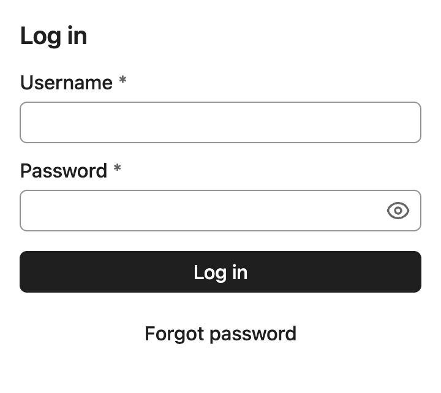
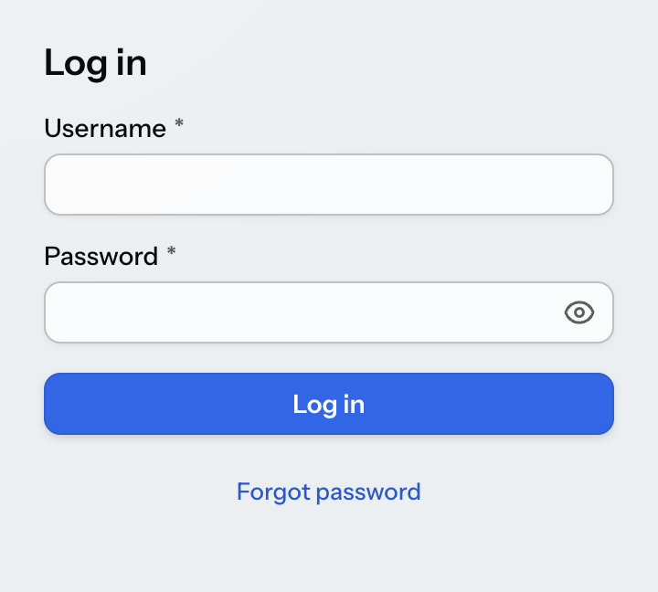
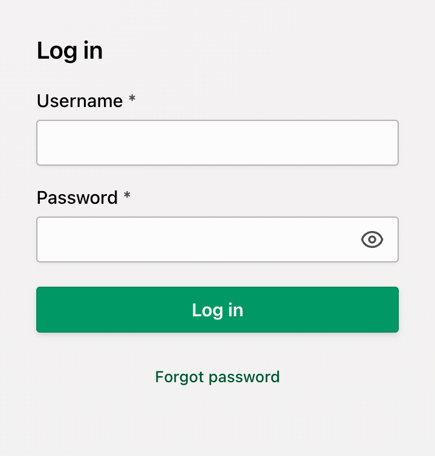
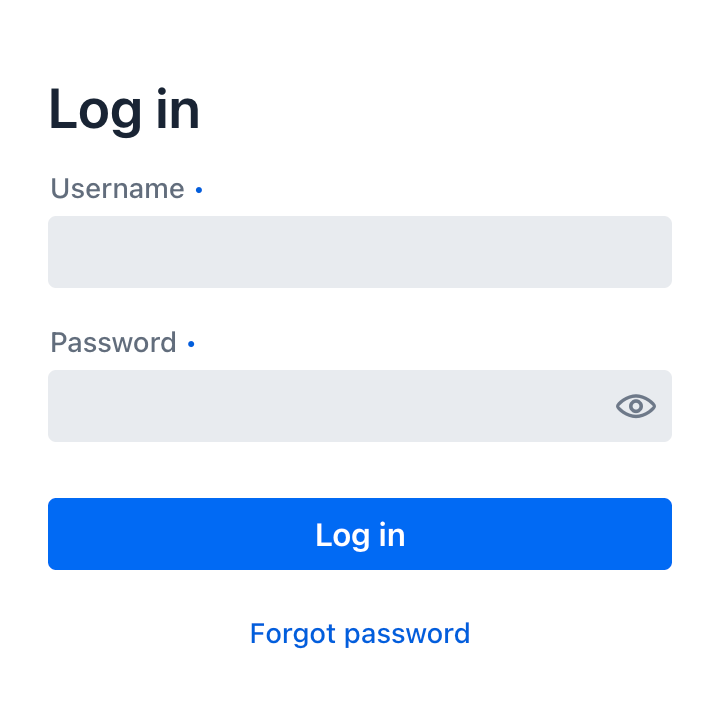
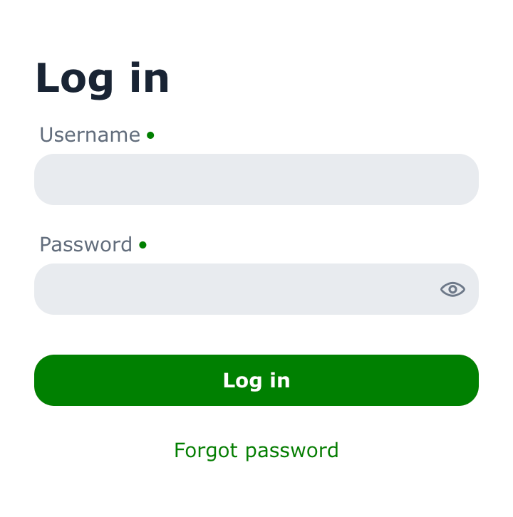

= Themes & Base Styles

By default, Vaadin components are rendered with their minimal <<base#,_base styles_>>. These can be a good starting point for creating a custom theme that should look significantly different than either of the two built-in themes.

.Login form using base styles
[.device]

.Avoid Mixing Theme-Specific Style Properties
[IMPORTANT]
When customizing themes or creating styles for custom components, don't mix the use of Aura (i.e., `--aura-\*`) and Lumo-specific (i.e., `--lumo-*`) style properties.

== Default Theme

When no [interfacename]`AppShellConfigurator` is defined in your application, the Aura theme CSS is automatically loaded as the default theme. In development mode, a log message suggests how to explicitly configure the theme.

To explicitly configure Aura, add the [annotationname]`@StyleSheet` annotation to your [interfacename]`AppShellConfigurator`:

[source,java]
----
@StyleSheet(Aura.STYLESHEET)
public class Application implements AppShellConfigurator {
}
----

Explicit configuration is recommended for production applications so the theme choice is clearly documented in code.

== Aura Theme

<<aura#,Aura>> is the default theme for Vaadin applications, offering a modern and cohesive design for all official components. It works out of the box with built-in variants for common use cases, while also providing high-level CSS custom properties for easy customization. By computing colors, contrast, and surface hierarchy automatically, Aura lets you focus on your application while still achieving consistent, high-quality results.

.Login form using the Aura theme
[.device]

To load the Aura theme in your application, add it with a [annotationname]`@StyleSheet` annotation on your main application class. The [classname]`Aura` class provides a constant for the path to the Aura stylesheet that can be used with the [annotationname]`@StyleSheet` annotation.

[source,java]
----
@StyleSheet(Aura.STYLESHEET)
@StyleSheet("styles.css")
public class Application implements AppShellConfigurator {
 ...
}
----

Themes should always be loaded _before_ any other styles in your application.

Aura includes a comprehensive set of style properties (custom CSS properties) that can be used to customize it without writing complicated CSS selectors.

.Login form using a customized Aura theme
[.device]

[source,css]
----
html {
  --aura-accent-color-light: #009966;
  --aura-background-color-light: #f3f1f1;
  --aura-base-font-size: 15;
  --aura-base-radius: 0;
  --aura-base-size: 20;
  --aura-contrast-level: 2;
  --aura-font-family: var(--aura-font-family-system);
}
----

== Lumo Theme

<<lumo#,Lumo>> is a theme for Vaadin applications that offers a clean and consistent design for all official components. While Aura is the default theme, Lumo remains a dependable alternative with a strong focus on clarity, accessibility, and predictability. It provides a solid foundation for building applications or creating custom themes on top.

.Login form using the Lumo theme
[.device]

To load the Lumo theme in your application, add it with a [annotationname]`@StyleSheet` annotation on your main application class. The [classname]`Lumo` class provides a constant for the path to the Lumo stylesheet that can be used with the [annotationname]`@StyleSheet` annotation.

[source,java]
----
@StyleSheet(Lumo.STYLESHEET)
@StyleSheet("styles.css")
public class Application implements AppShellConfigurator {
 ...
}
----

Themes should always be loaded _before_ any other styles in your application.

Lumo includes a comprehensive set of style properties (custom CSS properties) that can be used to customize it without writing complicated CSS selectors. See the <<lumo/lumo-style-properties#,Lumo style property reference>> for a complete list.

.Login form using a customized Lumo theme
[.device]

[source,css]
----
html {
  --lumo-primary-color: green;
  --lumo-primary-text-color: green;
  --lumo-font-family: Verdana;
  --lumo-font-size-m: 14px;
  --lumo-border-radius-m: 1em;
}
----

The <<{articles}/styling/utility-classes#lumo-utility-classes, Lumo Utility Classes>>, when enabled, can be used together with the Lumo theme.

[[color-schemes]]
== Light & Dark Color Schemes

Both Aura and Lumo support a light and dark color scheme. By default, the light color scheme is used. You can configure a different color scheme for the application by adding the [annotationname]`ColorScheme` annotation to your main application class.

[source,java]
----
@ColorScheme(ColorScheme.Value.DARK)
public class Application implements AppShellConfigurator {
    ...
}
----

The color scheme enum supports the following values:

[.property-table]
`ColorScheme.Value.LIGHT`:: Always use the light color scheme.
`ColorScheme.Value.DARK`:: Always use the dark color scheme.
`ColorScheme.Value.LIGHT_DARK`:: Use the light or dark color scheme based on the user's OS or browser settings, with a preference for the light color scheme.
`ColorScheme.Value.DARK_LIGHT`:: Use the dark or light color scheme based on the user's OS or browser settings, with a preference for the dark color scheme.

The color scheme can be changed dynamically at runtime using the [methodname]`Page.setColorScheme(ColorScheme.Value)` method.

[source,java]
----
UI.getCurrentOrThrow().getPage().setColorScheme(ColorScheme.Value.DARK);
----

.Testing Color Schemes with Browser DevTools
[NOTE]
====
You can emulate the user color scheme preference in browser developer tools:

- In Chrome, the Styles panel has a dropdown button with a paintbrush icon.
- In Firefox, the Styles panel has buttons with sun and moon icons.
- In Safari, the Elements panel has a dropdown button with a concentric circles icon.
====

[discussion-id]`6a974a47-d137-4d97-847c-80be46f011df`
