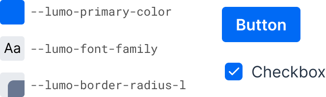

= Lumo

Lumo is the original Vaadin theme. It's based on a set of <<lumo-style-properties#, customizable style properties>>, and comes with built-in dark and compact variants.

.Lumo Style Properties Example & Use in Vaadin Components
[.fill.white]

The look and feel of all Vaadin components can be easily customized in a consistent manner across the entire application by supplying your own values to these style properties.

The built-in dark and compact variants are predefined sets of style property values that can be applied to the entire application or to parts of it.

The Lumo theme also includes a comprehensive set of CSS utility classes that can be applied to HTML elements and layout components through Java, to change their styling without writing any CSS of your own.

== Light & Dark Color Schemes

In the screenshot here, you can see the difference between the default light color variant on the left, and the dark variant on the right -- which are both built into Lumo.

image::_images/lumo-light-and-dark.png[Lumo theme Light and Dark variants]

See <<{articles}/styling/themes#color-schemes,Color Schemes>> for how to apply different color schemes in your application.

== Compact Preset

Lumo also has a compact preset that reduces fonts sizes -- and proportionally all Vaadin components. It's applied by loading an additional stylesheet containing a modified set of Lumo sizing properties:

[source,java]
----
@StyleSheet(Lumo.STYLESHEET)
@StyleSheet(Lumo.COMPACT_STYLESHEET)
public class Application implements AppShellConfigurator {
    ...
}
----

== Topics

The following topics are covered in this section:

section_outline::[]
