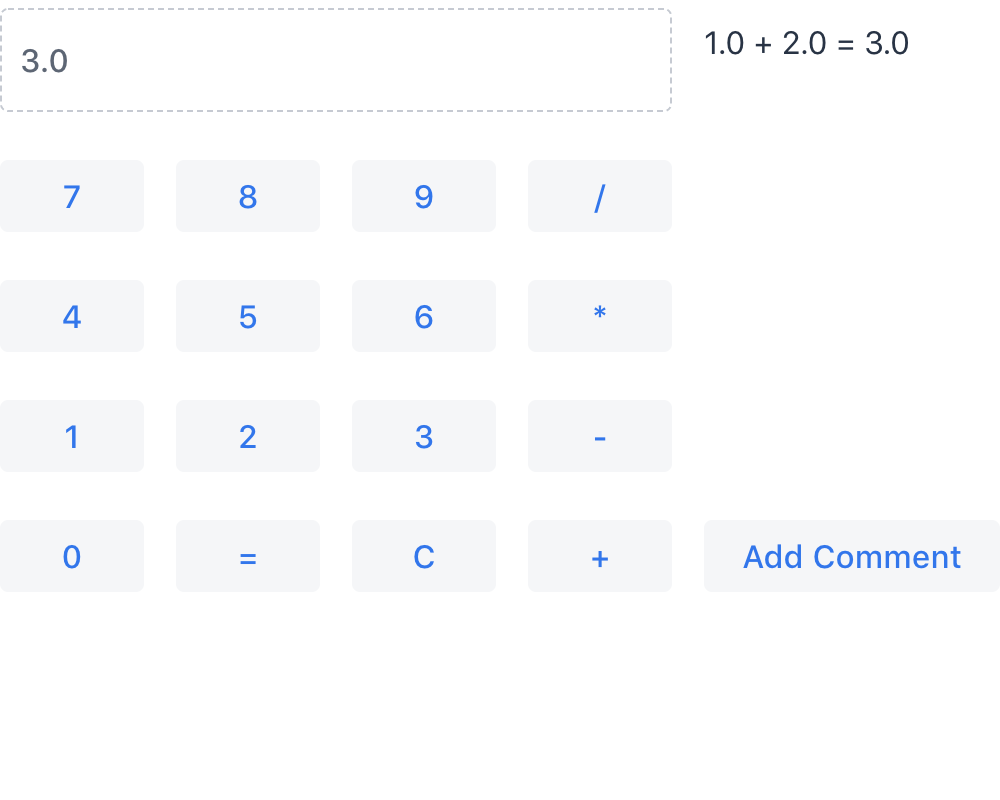
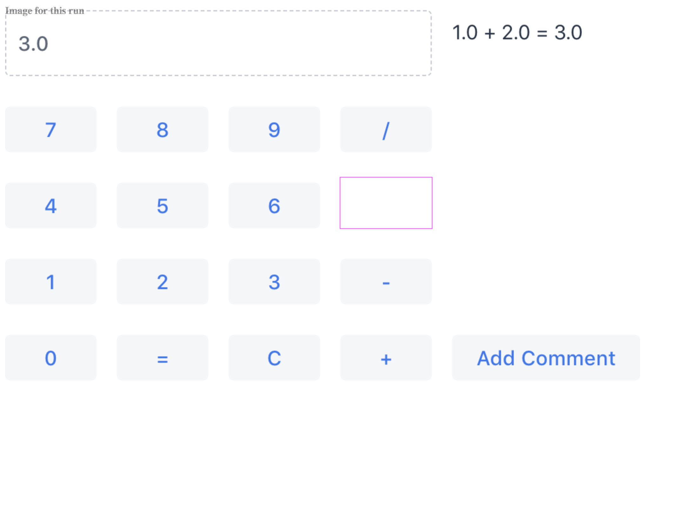

= Taking and Comparing Screenshots

You can take and compare screenshots with reference screenshots taken earlier. If there are differences, you can fail the test case.

[[screenshot-parameters]]
== Screenshot Parameters

The screenshot configuration parameters are defined with static methods in the `com.vaadin.testbench.Parameters` class.

[methodname]`screenshotErrorDirectory`(default: `null`):: Defines the directory where screenshots for failed tests or comparisons are stored.
[methodname]`screenshotReferenceDirectory`(default: `null`):: Defines the directory where the reference images for screenshot comparison are stored.
[methodname]`screenshotComparisonTolerance`(default: `0.01`):: Screen comparison is usually not done with exact pixel values because rendering in a browser often has minor inconsistencies.
Also, image compression may cause small artifacts.
[methodname]`screenshotComparisonCursorDetection`(default: `false`):: Some field components get a blinking cursor when they have the focus.
The cursor can cause unnecessary failures, depending on whether the blink happens to make the cursor visible or invisible, when taking a screenshot.
This parameter enables cursor detection that tries to minimize these failures.
[methodname]`maxScreenshotRetries`(default: `2`):: Sometimes a screenshot comparison may fail because the screen rendering has not yet finished, or there is a blinking cursor that's different from the reference screenshot.
For these reasons, Vaadin TestBench retries the screenshot comparison as many times as defined with this parameter.
[methodname]`screenshotRetryDelay`(default: `500`):: Delay in milliseconds before performing a screenshot retry when a comparison fails.

[NOTE]
If the directory names aren't absolute, they're assumed relative to the folder from where you run the tests. When using Maven, this is typically the root folder of the project.

Below is an example of this:

[source,java]
----
@Before
public void setUp() throws Exception {
    Parameters.setScreenshotErrorDirectory(
        "screenshots/errors");
    Parameters.setScreenshotReferenceDirectory(
        "screenshots/reference");
    Parameters.setMaxScreenshotRetries(2);
    Parameters.setScreenshotComparisonTolerance(1.0);
    Parameters.setScreenshotRetryDelay(10);
    Parameters.setScreenshotComparisonCursorDetection(true);
}
----

== Taking Screenshots on Failure

Vaadin TestBench can automatically take screenshots when a test fails.

[.example]
--
Include the `ScreenshotOnFailureRule` rule with a member variable annotated with `@Rule` in the test case.

[source,java]
----
<source-info group="JUnit 4"></source-info>
@Rule
public ScreenshotOnFailureRule screenshotOnFailureRule =
    new ScreenshotOnFailureRule(this, true);
----

Include the `ScreenshotOnFailureExtensions` rule with a member variable annotated with `@RegisterExtension` in the test case.

[source,java]
----
<source-info group="JUnit 5 (Since Vaadin 24.0)"></source-info>
@RegisterExtension
public ScreenshotOnFailureExtension screenshotOnFailureExtension =
    new ScreenshotOnFailureExtension(this, true);
----
--

You must not call [methodname]`quit()` for the driver in the `@After` method, as that would close the driver before the rule takes the screenshot. The rule automatically calls [methodname]`quit()` on the driver -- controlled by the `true` parameter -- so you can remove any calls to [methodname]`getDriver().quit()`.

The screenshots are written to the error directory defined with the `screenshotErrorDirectory` parameter. You can configure it in the test case setup, as follows:

[source,java]
----
@Before
public void setUp() throws Exception {
    Parameters.setScreenshotErrorDirectory("screenshots/errors");
    ...
}
----

== Taking Screenshots for Comparison

Vaadin TestBench allows screenshots of the web browser window to be taken with the [methodname]`compareScreen()` command in the `TestBenchCommands` interface. This method has many variants.

The [methodname]`compareScreen(File)` method takes a `File` object pointing to the reference image. In this case, a possible error image is written to the error directory with the same file name. You can get a file object to a reference image with the static [methodname]`ImageFileUtil.getReferenceScreenshotFile()` helper method.

[source,java]
----
assertTrue("Screenshots differ",
           testBench(driver).compareScreen(
               ImageFileUtil.getReferenceScreenshotFile(
                   "myshot.png")));
----

The [methodname]`compareScreen(String)` method takes a base name of the screenshot. It's appended with a browser identifier and the file extension.

[source,java]
----
assertTrue(testBench(driver).compareScreen("oneplustwo"));
----

The [methodname]`compareScreen(BufferedImage, String)` method allows the reference image to be kept in memory. An error image is written to a file with a name determined from the base name given as the second parameter.

Screenshots taken with the [methodname]`compareScreen()` method are compared to a reference image stored in the reference image folder. If differences are found or the reference image is missing, the comparison method returns `false` and stores the screenshot in the error folder. It also generates an HTML file that highlights the differing regions.

=== Screenshot Comparison Error Images

Screenshots with errors are written to the error folder, which is defined with the `screenshotErrorDirectory` parameter described in <<screenshot-parameters>>.

For example, the error caused by a missing reference image could be written to [filename]`screenshot/errors/oneplustwo_mac_chrome_64.png`.

.A screenshot taken by a test run

Screenshots cover the visible page area in the browser.
The size of the browser is therefore relevant for screenshot comparison.
The browser is normally sized with a predefined default size.
You can set the size of the browser window in a couple of ways.
You can set the size of the browser window with, for example, [methodname]`driver.manage().window().setSize(new Dimension(1024, 768));` in the `@Before` method.
The size includes any browser chrome, so the actual screenshot size is smaller.
To set the actual view area, you can use [methodname]`TestBenchCommands.resizeViewPortTo(1024, 768)`.

=== Reference Images

Reference images are usually found in the reference image folder, as defined with the `screenshotReferenceDirectory` parameter described in <<screenshot-parameters>>. To create a reference image, copy a screenshot from the `errors/` directory to the `reference/` directory.

For example:

[source,terminal]
----
cp screenshot/errors/oneplustwo_mac_chrome_64.png screenshot/reference/
----
Now, when the proper reference image exists, re-running the test outputs success like os:

----
$ java ...
JUnit version 4.5
.
Time: 18.222

OK (1 test)
----

=== Masking Screenshots

You can make masked screenshot comparisons with reference images that have non-opaque regions. Non-opaque pixels in the reference image (i.e., ones with less than 1.0 value in the alpha channel) are ignored in the screenshot comparison.

=== Visualization of Differences in Screenshots with Highlighting

Vaadin TestBench supports advanced difference visualization between a captured screenshot and the reference image. A difference report is written to an HTML file that has the same name as the failed screenshot, but with a `.html` suffix. The reports are written to the same `errors/` folder as the screenshots from the failed tests.

The differences in the images are highlighted with blue rectangles. Moving the mouse pointer over a square shows the difference area as it appears in the reference image. Clicking the image switches the entire view to the reference image and back.

The text "Image for this run" is displayed in the top-left corner of the screenshot to distinguish it from the reference image.
The screenshot here is an example of this:

.A highlighted error image

== Practices for Handling Screenshots

Access to the screenshot reference image directory should be arranged so that a developer who can view the results can copy the valid images to the reference directory. One possibility is to store the reference images in a version control system and check them out to the `reference/` directory.

A build system or a continuous integration system can be configured to collect automatically and store the screenshots as build artifacts.

[discussion-id]`8906C7B2-7B84-4408-9225-BAA37D5017E9`
