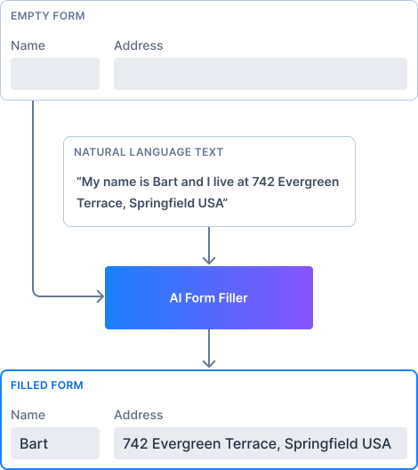

= AI Form Filler

AI Form Filler is an experimental feature that makes it easy to fill forms automatically from natural language input sources using ChatGPT technologies.

OpenAI ChatGPT is the large language model (LLM) model used by default with this feature. Any large language model can be adapted using the [interfacename]`LLMService` interface. See <<ai-models#,AI Models>> for more information.

[WARNING]
.Experimental Feature
AI Form Filler is an experimental feature. It may be removed, altered, or limited to commercial subscribers in future releases.

[.fill.white]

== Features

AI Form Filler has the following features in this experimental preview:

*Easy to Use; Works Out-of-the-Box*::
Built-in prompt engineering performs the job of generating a request containing the information related to the target components that works out-of-the-box for most cases. Once you've defined your form, only a couple of lines are required to use the Form Filler.

*Context Instructions*::
API to add more context instructions for the AI module (e.g., target language, vocabulary explanation, source context).
+
Use these instructions to provide extra information to the AI module about the general context of the input source.

*Component Instructions*::
API to add more component instructions for the AI module (e.g., field format, field explanation, field actions).
+
Use these instructions to give extra information to the AI module about a specific field when the built-in request or response of the form filler is not accurate enough.

*Components Supported*::
+
[columns]
- Text Field
- Email Field
- Password Field
- Number Field
- Integer Field
- BigDecimal Field
- Date Picker
- Time Picker
- DateTime Picker
- Text Area
- Checkbox
- Checkbox Group
- Radio Button Group
- Combo Box
- MultiSelect Combo Box
- Grid

*Types Supported for Grid Columns*::
+
[columns]
- Date
- LocalDate
- Time
- LocalTime
- DateTime
- LocalDateTime
- Boolean
- Integer
- Long
- Double
- Float
- String

== Related Pages

section_outline::[]

++++

++++
