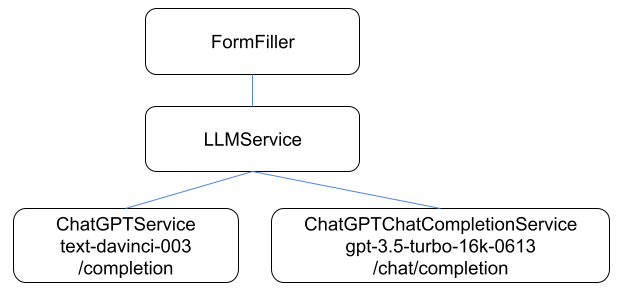

= AI Form Filler

The AI Form Filler addon is an experimental feature that provides an easy way for Flow users to create forms that are filled automatically from natural language input sources using ChatGPT technologies.

OpenAI ChatGPT is the large language model (LLM) model used by default with this feature. But any large language model can be adapted using the [interfacename]`LLMService` interface.

[WARNING]
.Experimental Feature
AI Form Filler is an experimental feature. It may be removed, altered, or limited to commercial subscribers in future releases.

== Features

AI Form Filler addon has the following features in this experimental preview:

*Supports Most Common Input Components of Flow*::

[col]
--
- Email Field
- Password Field
- Number Field
- Integer Field
- BigDecimal Field
- Date Picker
- Time Picker
- Date Time Picker
--

[col]
--
- Text Area
- Checkbox
- Checkbox Group
- Radio Button Group
- Combo Box
- MultiSelect Combo Box
- Grid
--
|===
|===

*Easy to Use; Works Out-of-the-Box*::

Built-in prompt engineering performs the job of generating a request containing the information related to the target components that works out-of-the-box for most cases. Once you've defined your form, only a couple of lines are required to use the Form Filler. 
|===
|===
*Context Instructions*::
API to add more context instructions for the AI module (e.g., target language, vocabulary explanation, source context). 
+
Use these instructions to provide extra information to the AI module about the general  context of the input source.
|===
|===
*Component Instructions*::
API to add more component instructions for the AI module (e.g., field format, field explanation, field actions). 
+
Use these instructions to give extra information to the AI module about a specific field when the built-in request or response of the form filler is not accurate enough.

=== Components Supported:

[col]
--
- Text Field
- Email Field
- Password Field
- Number Field
- Integer Field
- BigDecimal Field
- Date Picker
- Time Picker
--

[col]
--
- DateTime Picker
- Text Area
- Checkbox
- Checkbox Group
- Radio Button Group
- Combo Box
- MultiSelect Combo Box
- Grid
--

=== Types supported for Grid Columns:

[col]
--
- Date
- LocalDate
- Time
- LocalTime
- DateTime
- LocalDateTime
--

[col]
--
- Boolean
- Integer
- Long
- Double
- Float
- String
--

=== AI Models

The Form Filler provides two built-in LLM implementations using ChatGPT services. Both models are quite good at understanding and processing natural language. In any case, it is advised to try both implementations to find out which one fits better with your requirements. Even if ChatGPTChatCompletionService, using gpt-3.5-turbo-16k-0613 model, is more advanced, the LLM world is not something 100% predictable. You never know what model could work better. 

==== Implementing Custom AI Model Adapter

You can implement your own AI model adapter for ChatGPT or any other LLM provider. It is advised to use one of the existing implementations as a template if you want to create a new adaptor. Internal parameters such as the model name, temperature, or max tokens are up to the developer to be chosen and parametrized. The methods that are mandatory to be implemented are the ones described by the [interfacename]`LLMService` interface. 

First you need to implement the [methodname]`LLMService::getPromptTemplate` method to create the prompt that is sent to the AI module. This method receives all the internal structures generated automatically from the target form. Then you need to implement the [methodname]`LLMService::getGeneratedResponse` method that actually sends the prompt to the AI module. This method has to guarantee that the response is a valid JSON object using the same format that is sent in the request. 

[source,java]
----
/**
 * A LLM service that generates a response based on a prompt.
 * All responsibilities related to the model usage have to be
 * implemented in this service. This could be APIKEY providing,
 * parameter setting, prompt template generation, etc.
 */
public interface LLMService {

    /**
     * Generates a prompt based on the input, the target components and any
     * extra instruction.
     *
     * @param input the input text (e.g. "My name is John")
     * @param objectMap the objectMap containing the target components in a
     *                  hierarchical structure (keys = ids)
     * @param typesMap the map containing the desired type to fill with each
     *                 one of the target components (keys = ids)
     * @param componentInstructions the components (fields) instructions
     *                              containing additional information to understand
     *                              the field meaning.
     * @param contextInstructions the context instructions containing additional
     *                            information to understand the input or
     *                            providing some information not present in the input
     * @return the generated prompt to be sent to the AI module
     */
    public String getPromptTemplate(String input, Map<String, Object> objectMap, Map<String, String> typesMap, HashMap<Component, String> componentInstructions, ArrayList<String> contextInstructions);

    /**
     * Generates a response based on the input prompt from the AI module.
     *
     * @param prompt the prompt to be used by the AI module
     * @return the generated response from the AI module. This response has to
     * be a valid JSON Object using target field IDs as keys and the value
     * correctly formatted according to the target component. An example is
     * the following format:
     *  
     * <pre>{@code
     *     {
     *     "field Id 1": "value 1", // TextField
     *     "field Id 2": 66, // NumberField or IntegerField
     *     "field Id 3": "2022-04-03", // DatePicker
     *     "field Id 4 ": [ // Grid
     *          {
     *         "inner item id1": "Value 1",
     *         "inner item id2": "Value 2",
     *         "inner item id3": "Value 3"
     *          },
     *          {
     *         "inner item id1": "Value 1",
     *         "inner item id2": "Value 2",
     *         "inner item id3": "Value 3"
     *          }
     * ],
     * "field Id 5 ": ["Value 1", "Value 2"], // MultiSelectComboBox
     * "field Id 6": true, // Checkbox
     * "field Id 7": 43.47 // BigDecimalField
     * }
     * }</pre>  
     */
    public String getGeneratedResponse(String prompt);
}
----

Then use your new implemented service on the Form Filler constructor.

[source,java]
----
   FormFiller formFiller = new FormFiller(formLayout, new MyGPTService());
   FormFillerResult result = formFiller.fill(input);
----

== Topics

section_outline::[]

++++

++++