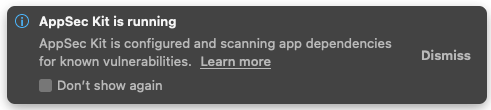
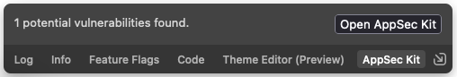
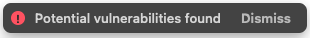
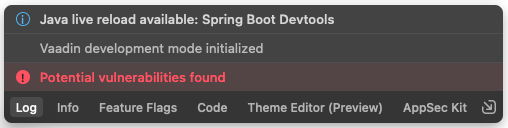
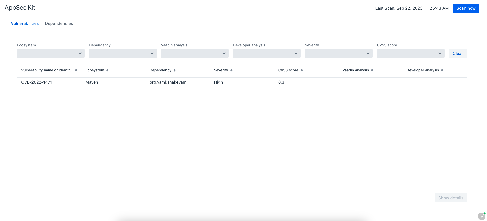
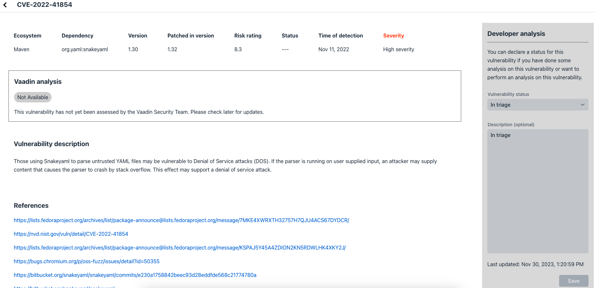
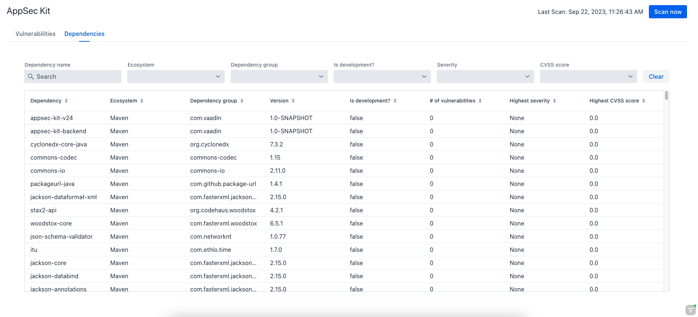

= [since:com.vaadin:vaadin@V24.2]#Getting Started with AppSec Kit#

AppSec Kit is an excellent tool for monitoring your application dependencies for vulnerabilities. It lets you see details of what's discovered. And you can record and store your analysis to share with other developers.

== Add AppSec Kit Dependency

To start, you'll need to add AppSec Kit as a dependency to your application. To add it to a Maven project, you might include something like this in your [filename]`pom.xml` file:

.pom.xml
[source,xml,subs="+attributes"]
----
<dependency>
    <groupId>com.vaadin</groupId>
    <artifactId>appsec-kit-starter</artifactId>
    <version>3.0.0</version>
</dependency>
----

See the https://github.com/vaadin/appsec-kit/releases[AppSec Kit releases page] for the latest version, or for a different version of the dependency.

== Generating SBOM Files

To be able to monitor the application dependencies, AppSec Kit needs the Software Bill of Materials (SBOM) files generated from Maven and npm dependencies. These files contain information about the dependencies and their transitives.

=== Maven Dependencies

To generate the SBOM file from Maven dependencies, you'll need to add the link:https://github.com/CycloneDX/cyclonedx-maven-plugin[`CycloneDX Maven Plugin`] to the plugins in your [filename]`pom.xml` file like so:

.pom.xml
[source,xml]
----
<plugin>
    <groupId>org.cyclonedx</groupId>
    <artifactId>cyclonedx-maven-plugin</artifactId>
    <version>2.7.7</version>
    <executions>
        <execution>
            <phase>generate-resources</phase>
            <goals>
                <goal>makeAggregateBom</goal>
            </goals>
        </execution>
    </executions>
    <configuration>
        <projectType>library</projectType>
        <schemaVersion>1.4</schemaVersion>
        <includeBomSerialNumber>true</includeBomSerialNumber>
        <includeCompileScope>true</includeCompileScope>
        <includeProvidedScope>true</includeProvidedScope>
        <includeRuntimeScope>true</includeRuntimeScope>
        <includeSystemScope>true</includeSystemScope>
        <includeTestScope>false</includeTestScope>
        <includeLicenseText>false</includeLicenseText>
        <outputReactorProjects>true</outputReactorProjects>
        <outputFormat>json</outputFormat>
        <outputName>bom</outputName>
        <outputDirectory>${project.build.outputDirectory}/resources</outputDirectory>
        <verbose>false</verbose>
    </configuration>
</plugin>
----

Before starting the application, make sure to run the `maven install` command. Then, the SBOM file, [filename]`bom.json` should be generated in the `/resources` sub-directory in the project's output directory. The plugin is configured to do this.

=== npm Dependencies

Because of the <</configuration/development-mode#precompiled-bundle, pre-compiled frontend bundle>>, which is enabled by default, no frontend libraries are downloaded or compiled and there is no [filename]`package.json` file in the project. If you use the pre-compiled frontend bundle you can *skip this step* because in this case AppSec Kit uses the bundled npm SBOM from Vaadin and does the vulnerability scan based on that.

If you <</configuration/development-mode#disable-precompiled-bundle, disable the pre-compiled frontend bundle>>, a [filename]`package.json` file is generated in your project -- or you can create your own file. To generate the SBOM file from npm dependencies defined in the [filename]`package.json` file, you'll need to run the link:https://www.npmjs.com/package/@cyclonedx/cyclonedx-npm[`@cyclonedx/cyclonedx-npm`] plugin with npx like so:

[source,shell]
----
npx --package @cyclonedx/cyclonedx-npm --call exit
----

The `@cyclonedx/cyclonedx-npm` plugin requires `node >= 14` and `npm >= 6` versions, also, the [filename]`package-lock.json` file and the [filename]`node_modules` folder should be present in order to successfully run.

To add it to the plugins, you would use the `exec-maven-plugin` in your [filename]`pom.xml` file like this:

.pom.xml
[source,xml]
----
<plugin>
    <groupId>org.codehaus.mojo</groupId>
    <artifactId>exec-maven-plugin</artifactId>
    <version>1.3.2</version>
    <executions>
        <execution>
            <id>cyclonedx-npm</id>
            <goals>
                <goal>exec</goal>
            </goals>
            <phase>generate-resources</phase>
            <configuration>
                <executable>npx</executable>
                <arguments>
                    <argument>@cyclonedx/cyclonedx-npm</argument>
                    <argument>--output-file</argument>
                    <argument>${project.build.outputDirectory}/resources/bom-npm.json</argument>
                    <argument>--output-format</argument>
                    <argument>JSON</argument>
                </arguments>
            </configuration>
        </execution>
    </executions>
</plugin>
----

Before starting the application, make sure to run the `npm install` and `mvn install` commands. Then, the SBOM file, [filename]`bom-npm.json` should be generated in the `/resources` sub-directory in the project's output directory. The plugin is configured to do this. AppSec Kit scans this SBOM file for vulnerabilities, if it's available.

=== External APIs

AppSec Kit calls external APIs to get vulnerabilities and vulnerability analysis for Vaadin dependencies. These calls are required for a normal operation thus they need to be accessible.

[source,text]
----
OSV (Open Source Vulnerability) API:
https://api.osv.dev/v1/querybatch
https://api.osv.dev/v1/vulns/

GitHub API:
https://api.github.com/repos/vaadin/flow/releases

Vaadin vulnerability analysis:
https://raw.githubusercontent.com/vaadin/vulnerability-analysis/main/analysis.json
----

== Start the Application

AppSec Kit isn't enabled in production mode. Therefore, you'll need to start your application in <</configuration/development-mode#, development mode>> -- which is the mode in which applications start by default. You don't need to enable this, explicitly.

== Vaadin Development Tools

The Vaadin Development Tools has a few aspects of which you should be aware, but which might not be so obvious. This section explains the user interface.

=== Notification Dialog

After the application has started, AppSec Kit analyzes the dependencies, collects any vulnerabilities, and displays a notification dialog through the <<devtools-notification,Vaadin Development Tools>>. See screenshot. There you'll see a link, labeled [guilabel]*Learn more*, that you can click on to open the UI in a new tab.

[[devtools-notification]]
.The AppSec Kit notification in Vaadin Development Tools.

=== AppSec Kit Tab

You can also open the Vaadin Development Tools and navigate to the <<devtools-appsec-kit-tab,AppSec Kit tab>> where you can see the found new vulnerabilities count. A vulnerability is considered as a new if a developer analysis has not been added to it yet. Therefore, vulnerabilities with developer analysis are not counted in the found vulnerabilities number. There's also a button, labeled [guibutton]*Open AppSec Kit*, that you can click on to open the UI in a new tab.

[[devtools-appsec-kit-tab]]
.The AppSec Kit tab in Vaadin Development Tools.

You can also navigate to the UI using the `vaadin-appsec-kit` route. For example, on your localhost, enter this in your browser: `http://localhost:8080/vaadin-appsec-kit`.

AppSec Kit automatically activates <</advanced/server-push#, server push>> if neither push nor polling is active for a UI where AppSec Kit is used so you'll be notified when new vulnerabilities are found. You can disable this functionality by overriding the default AppSec Kit <</tools/appsec/advanced-topics#appsec-kit-configuration, configuration>>.

=== Vulnerability Alert

When AppSec Kit finds vulnerabilities, it shows an alert pop-up concerning it. This pop-up disappears after a while.

[[devtools-vulnerability-alert]]
.Vaadin Development Tools Vulnerability Alert

When the alert pop-up disappears, the same message appears in the log feed under the [guilabel]*Log* tab.

[[devtools-log-tab]]
.Vaadin Development Tools Log Tab

If AppSec Kit doesn't find any vulnerability, it shows the _"No vulnerabilities found"_ message in the [guilabel]*AppSec Kit* tab, alert pop-up and log feed. If there hasn't been any vulnerability scan yet, the _"No data available yet"_ message is shown.

== AppSec Kit UI

The AppSec Kit UI has views for seeing vulnerabilities and dependencies of which you should be aware. This section describes those views, which can be found under the two main tabs of the UI.

=== Vulnerabilities Tab

When you open the UI, you'll see the [guilabel]*Vulnerabilities* tab. Sse screenshot. Any collected vulnerabilities are listed there. They're shown in a grid view, with columns to help identify each vulnerability, and the ecosystem and the dependency in which each has been found. It also includes the severity calculated from the CVSS vector string, a link:https://nvd.nist.gov/vuln-metrics/cvss[CVSS score] and some analyses.

You can filter the vulnerabilities by using the Ecosystem, Dependency, Vaadin analysis, Developer analysis, Severity, and Common Vulnerability Scoring System (i.e., CVSS) score filters. You'd choose these filters from the pull-down menus near the top to apply any of the filters. Click on the [guibutton]*Clear* button next to the filters to reset them.

You can also export the vulnerabilities with the [guibutton]*Export* button into a file named [filename]`vulnerabilities.csv`.

[[vulnerabilities-tab]]
.AppSec Kit Vulnerabilities View

To run a new scan, click the [guibutton]*Scan now* button at the top right corner. After it's finished, the `Last Scan` date and time is updated -- located also at the top right.

If you want to see more details about a particular vulnerability, select the row containing the vulnerability of interest, and then click the [guibutton]*Show details* button. Or you can double-click on a row. The `Vulnerability Details View` is then opened -- which is described next.

=== Vulnerability Details

When you open a listed vulnerability, you can find a more detailed description of it (see the screenshot here). You'll also find there links to other pages to explain the vulnerability and offer some general suggestions to resolve the vulnerability.

If the Vaadin Security Team is reviewing the vulnerability, it'll be noted at the top. This includes Vaadin's specific assessment and recommendations related to the vulnerability.

[[vulnerability-details]]
.AppSec Kit Vulnerability Details View

On the right side of the Details View, there's a `Developer analysis` panel. There you can set the `Vulnerability status` and add your own description and other information you've uncovered. Preserve what you enter by clicking the [guibutton]*Save* button. Note, your analysis is made available to other developers if you commit it to the version control system.

==== Dependencies Tab

To see your application dependencies, click on the [guilabel]*Dependencies* tab at the top left of the UI. There you'll find a list of dependencies shown in a grid view. See screenshot here.

They're listed in columns to help identify each dependency, ecosystem and the group to which it belongs, and the version. It also lists the _Is development_, which marks if an npm dependency is a development dependency -- for Maven dependencies this is always `false`. And it lists the count of vulnerabilities, the highest severity, and the highest CVSS score.

[[dependencies-tab]]
.AppSec Kit Dependencies View

You can filter the list of dependencies based on the Dependency name, Ecosystem, Dependency group, Is development?, Security, and the CVSS score. Choose these filters from the pull-down menus near the top to apply them. Click on the [guibutton]*Clear* button to reset them.

You can also export the dependencies with the [guibutton]*Export* button into a file named [filename]`dependencies.csv`.

If you want to see the vulnerabilities of a particular dependency, select the row containing the dependency of interest, and then click the [guibutton]*Show vulnerabilities* button. Or you can double-click on a row. The `Vulnerabilities Tab` is then opened with the vulnerabilities for that dependency.

++++

++++
