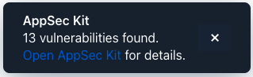
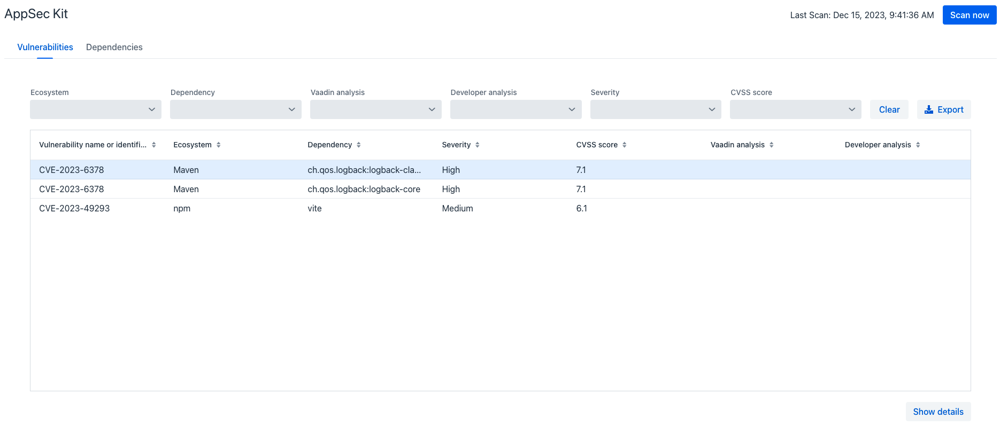
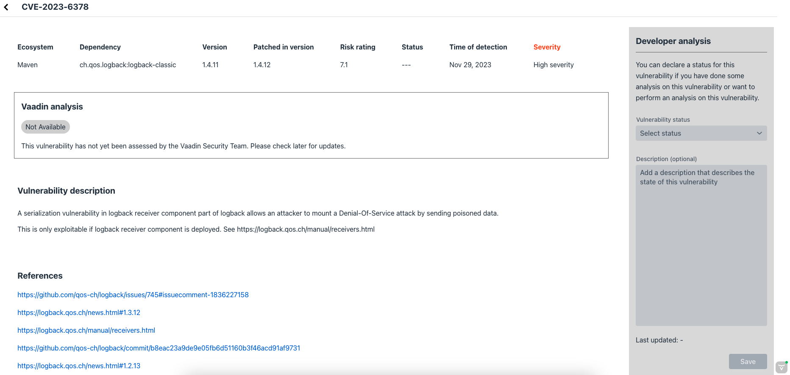

= Getting Started with AppSec Kit

AppSec Kit is an excellent tool for monitoring your application dependencies for vulnerabilities. It lets you see details of what's discovered. And you can record and store your analysis to share with other developers.

== Add AppSec Kit Dependency

To start, you'll need to add AppSec Kit as a dependency to your application. To add it to a Maven project, you might include something like this in your [filename]`pom.xml` file:

.pom.xml
[source,xml,subs="+attributes"]
----
<dependency>
    <groupId>com.vaadin</groupId>
    <artifactId>appsec-kit-starter</artifactId>
    <version>2.0.0</version>
</dependency>
----

See the https://github.com/vaadin/appsec-kit/releases[AppSec Kit releases page] for the latest version, or for a different version of the dependency.

== Generating SBOM Files

To be able to monitor the application dependencies, AppSec Kit needs the Software Bill of Materials (SBOM) files generated from Maven and npm dependencies. These files contain information about the dependencies and their transitives.

=== Maven Dependencies

To generate the SBOM file from Maven dependencies, you'll need to add the link:https://github.com/CycloneDX/cyclonedx-maven-plugin[`CycloneDX Maven Plugin`] to the plugins in your [filename]`pom.xml` file like so:

.pom.xml
[source,xml]
----
<plugin>
    <groupId>org.cyclonedx</groupId>
    <artifactId>cyclonedx-maven-plugin</artifactId>
    <version>2.7.7</version>
    <executions>
        <execution>
            <phase>generate-resources</phase>
            <goals>
                <goal>makeAggregateBom</goal>
            </goals>
        </execution>
    </executions>
    <configuration>
        <projectType>library</projectType>
        <schemaVersion>1.4</schemaVersion>
        <includeBomSerialNumber>true</includeBomSerialNumber>
        <includeCompileScope>true</includeCompileScope>
        <includeProvidedScope>true</includeProvidedScope>
        <includeRuntimeScope>true</includeRuntimeScope>
        <includeSystemScope>true</includeSystemScope>
        <includeTestScope>false</includeTestScope>
        <includeLicenseText>false</includeLicenseText>
        <outputReactorProjects>true</outputReactorProjects>
        <outputFormat>json</outputFormat>
        <outputName>bom</outputName>
        <outputDirectory>${project.build.outputDirectory}/resources</outputDirectory>
        <verbose>false</verbose>
    </configuration>
</plugin>
----

The SBOM file, [filename]`bom.json` should be generated in the `/resources` sub-directory in the project's output directory. The plugin is configured to do this.

=== npm Dependencies

To generate the SBOM file from npm dependencies defined in the [filename]`package.json` file, you'll need to run the link:https://www.npmjs.com/package/@cyclonedx/cyclonedx-npm[`@cyclonedx/cyclonedx-npm`] plugin with npx like so:

[source,shell]
----
npx --package @cyclonedx/cyclonedx-npm --call exit
----

To add it to the plugins, you would use the `exec-maven-plugin` in your [filename]`pom.xml` file like this:

.pom.xml
[source,xml]
----
<plugin>
    <groupId>org.codehaus.mojo</groupId>
    <artifactId>exec-maven-plugin</artifactId>
    <version>1.3.2</version>
    <executions>
        <execution>
            <id>cyclonedx-npm</id>
            <goals>
                <goal>exec</goal>
            </goals>
            <phase>generate-resources</phase>
            <configuration>
                <executable>npx</executable>
                <arguments>
                    <argument>@cyclonedx/cyclonedx-npm</argument>
                    <argument>--output-file</argument>
                    <argument>${project.build.outputDirectory}/resources/bom-npm.json</argument>
                    <argument>--output-format</argument>
                    <argument>JSON</argument>
                </arguments>
            </configuration>
        </execution>
    </executions>
</plugin>
----

The SBOM file, [filename]`bom-npm.json` should be generated in the `/resources` sub-directory in the project's output directory. The plugin is configured to do this. AppSec Kit scans this SBOM file for vulnerabilities, if it's available.

== Start the Application

AppSec Kit isn't enabled in production mode. Therefore, you'll need to start your application in <</configuration/development-mode#, development mode>> -- which is the mode in which applications start by default. You don't need to enable this, explicitly.

=== Notification Dialog

After the application has started, AppSec Kit analyzes the dependencies, collects any vulnerabilities, and displays a notification dialog. See screenshot. There you'll see a link, labeled _Open AppSec Kit_, that you can click on to open the UI in a new tab.

[[notification-dialog]]
.AppSec Kit Notification Dialog

You can also navigate to the UI using the `vaadin-appsec-kit` route. For example, on your localhost, enter something like this in your browser: link:http://localhost:8080/vaadin-appsec-kit[http://localhost:8080/vaadin-appsec-kit].

You should configure link:/docs/v23/advanced/server-push[server push] for a `UI` so you'll be notified when new vulnerabilities are found. You can do this by adding the `@Push` annotation to a UI class like so:

[source,java]
----
@Push
public class ExampleUI extends UI {
    // ...
}
----

== AppSec Kit UI

The AppSec Kit UI has views for seeing vulnerabilities and dependencies of which you should be aware. This section describes those views, which can be found under the two main tabs of the UI.

=== Vulnerabilities Tab

When you open the UI, you'll see the [guilabel]*Vulnerabilities* tab (see screenshot). Any collected vulnerabilities are listed there. They're shown in a grid view, with columns to help identify each vulnerability, and the ecosystem and the dependency in which each has been found. It also includes the severity calculated from the CVSS vector string, a link:https://nvd.nist.gov/vuln-metrics/cvss[CVSS score] and some analyses.

You can filter the vulnerabilities by using the Ecosystem, Dependency, Vaadin analysis, Developer analysis, Severity, and Common Vulnerability Scoring System (i.e., CVSS) score filters. You'd choose these filters from the pull-down menus near the top to apply any of the filters. Click on the [guibutton]*Clear* button next to the filters to reset them.

[[vulnerabilities-tab]]
.AppSec Kit Vulnerabilities View

To run a new scan, click the [guibutton]*Scan now* button at the top right corner. After it's finished, the `Last Scan` date and time is updated -- located also at the top right.

If you want to see more details about a particular vulnerability, select the row containing the vulnerability of interest, and then click the [guibutton]*Show details* button. Or you can double-click on a row. The `Vulnerability Details View` is then opened -- which is described next.

=== Vulnerability Details

When you open a listed vulnerability, you can find a more detailed description of it (see the screenshot here). You'll also find there links to other pages to explain the vulnerability and offer some general suggestions to resolve the vulnerability.

If the Vaadin Security Team is reviewing the vulnerability, it'll be noted at the top. This includes Vaadin's specific assessment and recommendations related to the vulnerability.

[[vulnerability-details]]
.AppSec Kit Vulnerability Details View

On the right side of the Details View, there's a `Developer analysis` panel. There you can set the `Vulnerability status` and add your own description and other information you've uncovered. Preserve what you enter by clicking the [guibutton]*Save* button. Note, your analysis is made available to other developers if you commit it to the version control system.

==== Dependencies Tab

To see your application dependencies, click on the [guilabel]*Dependencies* tab at the top left of the UI. There you'll find a list of dependencies shown in a grid view (see screenshot here).

They're listed in columns to help identify each dependency, ecosystem and the group to which it belongs, and the version. It also lists the _Is development_, which marks if an npm dependency is a development dependency -- for Maven dependencies this is always `false`. And it lists the count of vulnerabilities, the highest severity, and the highest CVSS score.

[[dependencies-tab]]
.AppSec Kit Dependencies View
image::images/dependencies-tab.png[]

You can filter the list of dependencies based on the Ecosystem, Dependency group, Is development?, Security, and the CVSS score. Choose these filters from the pull-down menus near the top to apply them. Click on the [guibutton]*Clear* button to reset them.

++++

++++
