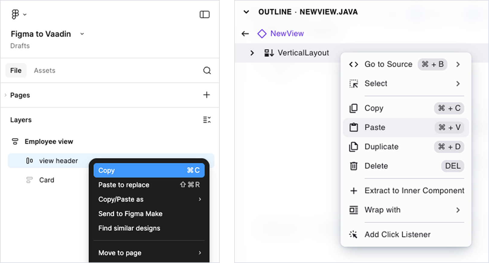

= [since:com.vaadin:vaadin@V24.5]#Figma to Code#

Figma to Vaadin is a feature of Vaadin Copilot that allows developers to copy designs from Figma and paste them directly into a Vaadin project, where Copilot automatically translates the design structure into Vaadin UI components.

The import process does not rely on AI interpretation of visual layouts. Copilot parses pasted Figma data into Vaadin UI code. This deterministic process ensures the same Figma design always produces the same UI output.

The translation is based on component metadata and layout structure defined in Figma.

== How to Use

. In Figma, select a frame or a section of a design.
. Copy it to the clipboard using `Ctrl/Cmd + C`.
. Make sure your Vaadin project is running and Vaadin Copilot is enabled.
. In your project, navigate to the location where you want to insert the UI.
. Select one of existing layout components and paste Figma data using `Ctrl/Cmd + V`.

After a few seconds, the application refreshes and shows the generated UI.

You can copy an entire artboard or only a smaller section of a larger design.

== Limitations

Out of the box, Figma to Vaadin generates functional UI components when designs use Figma components from the https://www.figma.com/community/file/843042473942860131[Vaadin Design System Figma library].

The translator relies on Figma component's metadata. Figma's *Auto Layouts* are translated to *Horizontal* or *Vertical Layouts*. Unrecognized components will result static divs and spans instead of web components.

Dialogs, overlays, and notifications are not supported because their behavior requires interaction logic that cannot be inferred from static design data.

== Extending Support to Custom Components

The importer can be extended to support your own Figma components. The custom components can extend Vaadin DS components or be created from scratch.

The extension mechanism is based on registering custom importer functions. These functions inspect Figma nodes during paste and define how they should be translated into Vaadin components.

The general process is:

. Add a unique marker property to your Figma components so they can be identified during import.
. Create a TypeScript importer module in your Vaadin project.
. Implement and register importer functions that:
  * Detect the marker property.
  * Map Figma properties to Vaadin component properties.
  * Define how children are translated.
. Register the importer module so it is loaded in development mode.

When properly registered, copying a matching Figma component generates instances of your custom Vaadin components instead of default elements.

For detailed instructions and examples, see:
https://vaadin.com/blog/how-to-use-own-figma-components-in-vaadin-applications[How to use own Figma components in Vaadin applications].

== Optimize Figma Designs for Import

To accurately transform a Figma design into Vaadin code, the design must have a clear structure and use known components.

=== Use Auto Layout

Auto Layout defines structured layouts in Figma and closely maps to CSS Flexbox, which Vaadin layouts are based on.

Using Auto Layout ensures predictable results. Elements placed inside regular groups or frames without Auto Layout may still be imported, but their positioning can be less accurate.

Avoid disabling Auto Layout or using absolute positioning unless necessary.

=== Use Vaadin Design System components

Start with the https://www.figma.com/community/file/843042473942860131[Vaadin Design System Figma library].
Most Vaadin components are supported. Interactive elements such as dialogs and overlays are excluded.

=== Configure components using properties

Configure components using their built-in properties instead of manually modifying visual appearance.

For example, set a field to an “invalid” state using component properties instead of changing its background color manually. Property-based configuration produces more accurate and functional code.

=== Typography

Regular text layers in Figma are translated into `` elements without additional styling.

To ensure correct semantic output, use text styles from the Vaadin Design System library:

* Heading styles are translated into `H1`–`H6` elements.
* Body text styles are translated into `` elements with corresponding size classes.

Text fill colors are not preserved. The application’s default text color is used.

=== Other Elements

The following table describes how common Figma elements are translated:

[cols="1,1", options="header"]
|===
|Figma element |Vaadin element

|Text layer
|``

|Rectangle
|`
` with fill, border, and border radius

|Group
|`
`

|Frame
|`
` with fill and border

|Frame with Auto Layout
|`VerticalLayout` or `HorizontalLayout` with alignment and spacing

|Ellipse, Polygon, Star
|Not supported

|Line, Arrow, Pen
|Not supported

|Slice
|Not supported
|===
