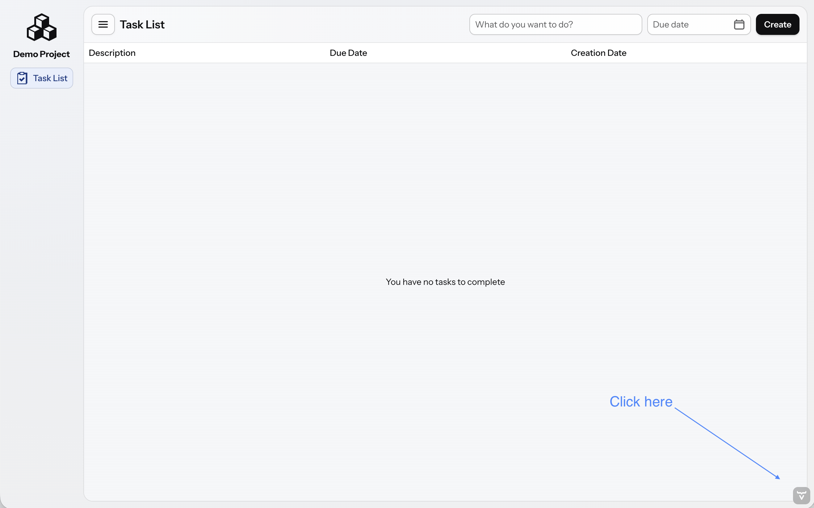

= [since:com.vaadin:vaadin@V24.4]#Vaadin Copilot#

Vaadin Copilot is a useful tool that's ready to assist you when you run an application in development mode. Copilot is a visual development tool, and it's an AI-empowered assistant. With it, you can inspect and edit the UI, and use generative AI to help with a variety of tasks.

[NOTE]
Copilot functionality that makes changes to code, including but not limited to AI functionality, requires you to log in and accept the terms and conditions. This functionality is available for all subscribers.

Vaadin Copilot is designed to work seamlessly with an IDE, and to fit into regular development workflow. When activated, Copilot appears in the browser, on top of your running application. You can switch between your IDE and Copilot to make changes where it's most convenient.

== Getting Started

Vaadin Copilot comes built into the development mode of your application; you don't need to install anything.

See the <</getting-started/start#, Start a Project>> guide for more information. Also, see the <</getting-started/import#, Import to an IDE>>, and <</getting-started/run#, Run an Application>> documentation pages.

Once your application is running, click the image:images/activation-button.png[Activation button,26] button to activate or deactivate Copilot.

*Brief Step-by-Step Instructions*

- Go to https://start.vaadin.com/?preset=hilla[start.vaadin.com] and click _Download Project_.
- After downloading, unzip the project.
- Run `./mvnw` in the project folder.
- Once the project opens in your browser, click the image:images/activation-button.png[Activation button,26] button.

=== Development Workflow

Vaadin Copilot helps you to set up a development environment by suggesting and guiding you through installation of an IDE plugin and enabling a Java hotswap solution. Development workflow helper is available directly from the image:images/activation-button.png[Activation,26] menu and the Info panel.

=== Copilot Trial

Vaadin Copilot provides features that are free for all users. However, features related to view manipulation and AI usage require a subscription. You may try those features for free by activating a three-day preview or by starting a 30-day trial period.

== Basic Operation

Copilot supersedes previous development tools, and is activated via the same image:images/activation-button.png[Activation,26] button that appears on top of your application in development mode. When activated, Copilot takes over the browser and disables interaction with the application until it's deactivated.

Enable the keyboard shortcuts so you can effortlessly enter and exit Copilot while you're developing.

pass:[<!-- vale Vaadin.Abbr = NO -->]

=== Keyboard Shortcuts

The shortcut to enable Copilot is kbd:[⇧+CTRL+CTRL] or kbd:[⇧+CMD+CMD]. Meaning, hold kbd:[SHIFT] while pressing kbd:[CTRL] or kbd:[CMD] twice in quick succession.

You can deactivate Copilot using the same shortcut you used to activate it. When active, you can use kbd:[⇧+SPACE] (i.e., while holding kbd:[SHIFT], press kbd:[SPACEBAR]) to open the command window. Use kbd:[ESC] to close it again.

pass:[<!-- vale Vaadin.Abbr = YES -->]

== Vaadin Copilot UI

The Copilot UI consists of five main parts. Referring to the numbers in the graphic that follows, the *➀ Activation Button* activates and deactivates Copilot, and hosts a popup menu with some configuration options. This is the only functionality available when Copilot is not activated. Once activated, Copilot offers more.

*➁ Drawers* are located to the left, right, and bottom edges of the browser window, and appear when you move the mouse close enough to those edges. Drawers are where you'll find most of the Copilot functionality tucked away by default.

image::images/overview.png[Vaadin Copilot UI Overview]

Each Drawer contains *➂ Panels*, with each representing a specific functionality. Each panel can be turned into a *➃ Floating Panel* so that it doesn't auto-hide with the Drawer, and can be moved, collapsed, and resized.

The *➄ Command window* is a context-sensitive popup window with an input prompt. This is where you can give commands to the AI.

== Built-In Panels

|===
|Panel |Default Drawer |Description

|Documentation
|Right
|Vaadin documentation for selected component.

|Theme Editor
|Right
|Allows you to change style of selected component, modify the theme global properties and save your browser inspector changes into application stylesheet.

|Info
|Right
|Application information. Includes guide on how to enable HotSwap.

|Accessibility Checker (a11y)
|Right
|Accessibility testing engine. Helps to identify common accessibility issues like missing page title or missing input label. Provides recommendations how to fix them.

|UI Test Generation
|Right
|Generates Playwright UI tests for current Flow and Hilla view. _Experimental feature_.

|Internationalization (i18n)
|Right
|Make the UI ready for localization by generating translation keys for text elements, and converting static strings in UI code to translation API calls. See <<i18n#, Internationalization>>.

|Features
|Right
|Manage <<{articles}/flow/configuration/feature-flags#,Feature Flags>>.

|Outline
|Left
|Component/element hierarchy. Hover to highlight; click to select; and drag & drop to rearrange.

|Palette
|Left
|A palette containing Vaadin and composite components. Drag to UI or Outline to add to the application.

|Routes
|Left
|List of application routes with corresponding components and information about access control.

|UI Services
|Left
|List of Hilla services with corresponding parameters and information about access control.

|Log
|Bottom
|Application debug message log with a preview of Hilla endpoints requests and responses.

|===

== Plugins

Copilot uses a plugin architecture which allows additional functionality to appear as panels. This includes tools such as Vaadin AppSec Kit, as well as third-party plugins.

== Context Menu

*Go to Source*:: Your IDE opens the source file on the row where the component is created.

*Select*:: Convenient way of selecting parent and sibling components.

*Copy*, *Paste*:: Copy and paste selected component. See
<<additional-features,Additional Features>> for more information.

[Read more about additional Copilot features.]

*Wrap with...*:: Wrap the selected components within a new layout. The components are placed in the layout in the same order you select them. The resulting layout is placed in the same place as the first component you select.

*Duplicate*:: Make a copy of the component.

*Add click listener*:: A quick way to add a click listener stub to the source code. Your IDE opens the source file on the row where the listener has been added.

*Delete*:: Delete the component.

== Drag & Drop

You can rearrange components by using drag-and-drop. Drop zones appear to visualize where components can be dropped. You can also use drag-and-drop on the Outline, and drag in new components from the Palette.

== AI Assistant

You can ask Copilot to perform tasks related to view manipulation using a natural language prompt in the Command window popup. The AI does its best to fulfill your request. Think of it as a very helpful junior developer, who remembers plenty about topics you might have forgotten or not looked into yet, but is still very inexperienced and needs supervision. It's slower than you on small tasks if you already know exactly how to do them. It's faster, though, if you need to research how to do a task, or if it involves plenty of typing.

Basically, be ready to fix minor mistakes, undo a whole change -- but be prepared to be pleasantly surprised.

== Context & Selection

When you use the AI, it knows a good bit about your project and tech stack -- and which components you've selected, if any. It tries to make use of that information when possible: such as when you refer to a button, selected components, or similar items.

== Example Prompts

To learn how to use Copilot, you might start by trying to perform some small tasks. Below are suggestions of common tasks.

Try to do the following to make a button primary:

[source]
----
> make the button primary
----

This type of task can be slow compared to making the change, manually. However, it can be very useful when you don't remember how to do it in the code.

Bootstrapping a new form or generating placeholder content can be very convenient. Try this:

[source]
----
> add comprehensive fields for contact details and international shipping and billing
----

Prompts can affect multiple components, and take context into account without being very specific in the prompt. To make those changes and addition, try these:

[source]
----
> make the width of each field match the expected input

> add a placeholder to each field
----

The AI may be able to help with UX considerations. Try these tasks:

[source]
----
> follow UX best practices for placeholders

> group fields into natural sections
----

== IDE Integration

When developing UIs, there's a tendency to switch repeatedly between code and the browser to verify and tweak the results. You should be able to code when needed, and do changes directly in the UI when that feels more appropriate.

Vaadin Copilot integrates seamlessly into your regular development workflow. This way you can switch back and forth between the code in your IDE and Copilot, depending on which is appropriate. Copilot considers the file on disk to be the source of truth. All changes are made to the file, then hot deployed to the browser.

To get the best Copilot experience, use the Vaadin plugin for link:https://plugins.jetbrains.com/plugin/23758-vaadin[IntelliJ] or link:https://marketplace.visualstudio.com/items?itemName=vaadin.vaadin-vscode[Visual Studio Code]. The plugin improves saving changes you made into your files and integrates with the undo-functionality (IntelliJ only).

Depending on the IDE, Vaadin plugin might display additional hints for improving development process.

=== Java Hot Swapping

Vaadin IDE plugins introduce `Debug using HotSwap`. This is a run configuration that simplifies the process of running applications with a given hot swap solution.

== Figma to Vaadin

Vaadin Copilot allows users to copy and paste Figma designs that are based on the Vaadin Design System, to create Hilla and Flow views. See the https://www.figma.com/community/file/1430138010973103197/figma-to-vaadin[Figma documentation] to learn more about copying Figma designs to Vaadin.

== Additional Features[[additional-features]]

Copilot has a few additional features worth considering. They're listed in the sub-sections here.

=== Selected Component Toolbar

After selecting view component, toolbar is displayed to provide additional layout options like setting alignment, adjusting padding, or changing a gap.

=== Paste Image

It's possible to paste images into a view. The image file is saved in the project resources directory.

=== Form from Java Bean

Dropping the Java bean file into a view results in a form being created based on the bean's properties types.

Below is an example of this with a Java bean:

[source,java]
----
public class User {

    private String name;

    private Integer age;

    private LocalDate birthday;

    // getters and setters
}
----

== Limitations

It's best to know the limitations of software that you use. These are some known limitations of using Copilot with Vaadin:

- Not all views or hierarchies can be edited via drag-and-drop. In particular, parts of the UI created programmatically (e.g., loops) can cause problems.
- AI makes mistakes.
- AI is currently limited to smaller one-view tasks.
- Code formatting is dependent on user IDE configuration. If the user has configured formatting on a file save, Vaadin IntelliJ plugin triggers it. Otherwise, running code format manually is required.

=== Additional Notes

- Vaadin Copilot contains all of the functionality found previously in Development Tools.
- It's possible to disable Vaadin Copilot using `vaadin.copilot.enable=false` system property.
- It's not possible to disable explicitly any AI features of Vaadin Copilot.
