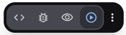
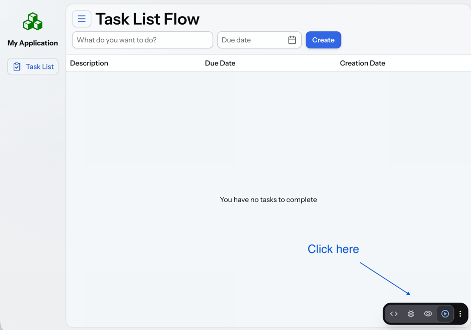
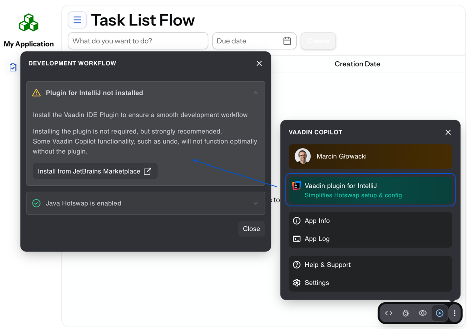
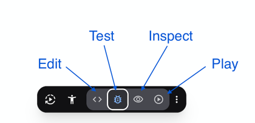
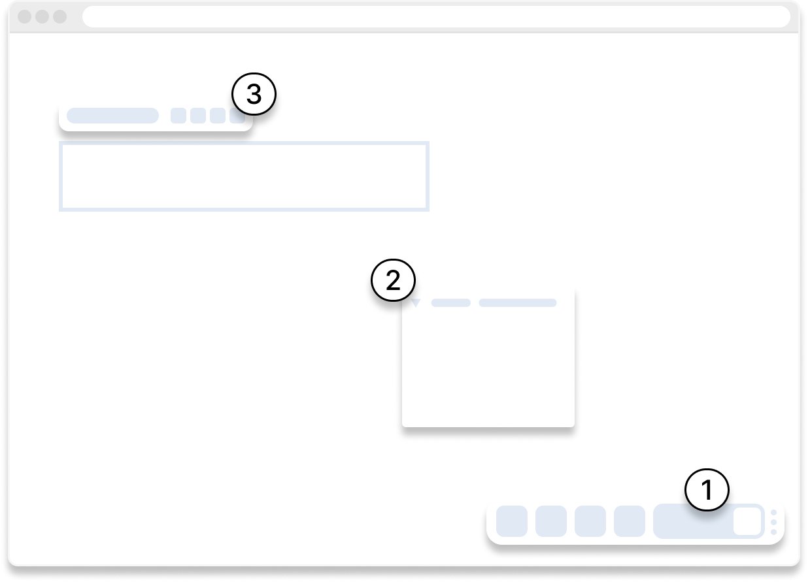

= Vaadin Copilot

Vaadin Copilot is a useful tool that's ready to assist you when you run an application in development mode. Copilot is a visual development tool, and it's an AI-empowered assistant. With it, you can inspect and edit the UI, and use generative AI to help with a variety of tasks.

[NOTE]
Copilot functionality that makes changes to code, including but not limited to AI functionality, requires you to log in using Vaadin account.

Vaadin Copilot is designed to work seamlessly with an IDE, and to fit into regular development workflow. When activated, Copilot appears in the browser, on top of your running application. You can switch between your IDE and Copilot to make changes where it's most convenient.

== Getting Started

Vaadin Copilot comes built into the development mode of your application; you don't need to install anything.

See the <</getting-started/quick-start#,Quick Start>> guide for more information. Also, see the <</getting-started/dev-environment/import#, Import to an IDE>>, and <</getting-started/dev-environment/run#, Run an Application>> documentation pages.

Once your application is running, Copilot toolbar  is present in bottom right of the screen.

=== Development Workflow

Vaadin Copilot helps you to set up a development environment by suggesting and guiding you through installation of an IDE plugin and enabling a Java hotswap solution. Development workflow helper is available directly from the menu and the Info panel.

== Basic Operation

Copilot allows to switch operating modes during development of your application. We can distinguish four modes:
- Play mode - normal interaction with application
- Inspect mode - Copilot can be used to analyze structure and components of given view
- Test mode - Copilot can help you generate tests and check accessibility compliance
- Edit mode - Copilot can help you to modify your application with use of visual edition and AI tools

With keyboard shortcuts you can effortlessly toggle Play and recent Copilot mode while you're developing.

pass:[<!-- vale Vaadin.Abbr = NO -->]

=== Keyboard Shortcuts

The shortcut to toggle Copilot Play and last used mode is kbd:[⇧+CTRL+CTRL] or kbd:[⇧+CMD+CMD]. Meaning, hold kbd:[SHIFT] while pressing kbd:[CTRL] or kbd:[CMD] twice in quick succession.

pass:[<!-- vale Vaadin.Abbr = YES -->]

== Vaadin Copilot UI

The Copilot UI consists of two main parts. Referring to the numbers in the graphic that follows, the *➀ Toolbar* allows changing current Copilot mode. Use Toolbar menu  to access Setting, Application Info, Application Logs and more.

Floating *➁ Panels*, with each representing a specific functionality. Each panel can be dragged, resized and closed.

After selecting component in the view, *➂ Component badge* is displayed. It contains set of utilities like AI prompt, sizing and padding helpers, component properties, and a Documentation action that opens the Vaadin documentation for the selected component.

== Built-In Panels

|===
|Panel |Location |Description

|Accessibility Checker (a11y)
|Toolbar Test mode
|Accessibility testing engine. Helps to identify common accessibility issues like missing page title or missing input label. Provides recommendations how to fix them.

|Annotations
|Toolbar Test mode
|Annotate your views with comments including references to components. Great for sharing notes with your team (via file sharing in control version so far) or keeping track of things to fix. Use AI to fix the comments and resolve them.

|App Info
|Toolbar menu
|Application information. Includes guide on how to enable HotSwap.

|App Log
|Toolbar menu
|Application debug message log with a preview of Hilla endpoints requests and responses.

|Backend & Data
|Toolbar Edit mode
|Access to H2 console and project dependencies helper. Allows setting up Spring Security.

|Documentation
|Toolbar Edit and Inspect modes
|Vaadin documentation for selected component.

|Features
|Toolbar menu
|Manage <<{articles}/flow/configuration/feature-flags#,Feature Flags>>.

|Internationalization (i18n)
|Toolbar Edit mode
|Make the UI ready for localization by generating translation keys for text elements, and converting static strings in UI code to translation API calls. See <<i18n#, Internationalization>>. _Experimental feature_.

|Outline
|Toolbar Edit and Inspect modes
|Component/element hierarchy. Hover to highlight; click to select; and drag & drop to rearrange.

|Properties
|Toolbar Edit and Inspect modes
|Properties editor for selected component.

|Theme Editor
|Toolbar Edit mode
|Allows you to change style of selected component, modify the theme global properties and save your browser inspector changes into application stylesheet. For applications using the Aura theme, the global theme editor lets you restyle the application quickly: choose a color-scheme mode (Light, Dark, Auto, or Mixed), pick from curated accent and background color palettes, or use the shuffle button to randomize theme properties and explore different looks.

|UI Library
|Toolbar Edit mode
|A palette containing Vaadin and custom components. Drag to UI or Outline to add to the application. Create sections to customize the palette with your own components and Vaadin components to improve your UX.

|UI Services
|Toolbar Edit mode
|List of Hilla services with corresponding parameters and information about access control.

|UI Test Generation
|Toolbar Test mode
|Generates Playwright UI tests for current Flow and Hilla view. _Experimental feature_.

|UI Test Recorder
|Toolbar Test mode
|Records user interactions to generate end-to-end Vaadin TestBench tests automatically. _Experimental feature_.

|Views & Routes
|Toolbar Edit mode
|List of application routes with corresponding components and information about access control. Allows to create new views based on templates or using AI. When adding a view, you can pick an icon for its menu item from an icon gallery that detects the icon sets available on the application classpath. The Edit access control button appears only when Spring Security is enabled in the project.

|===

== Plugins

Copilot uses a plugin architecture which allows additional functionality to appear as panels. This includes tools such as Vaadin AppSec Kit, as well as third-party plugins.

== Context Menu

*Go to Source*:: Your IDE opens the source file on the row where the component is created.

*Select*:: Convenient way of selecting parent and sibling components.

*Copy*, *Paste*, *Duplicate*, *Delete*:: Copy, paste, duplicate and delete selected component. See
<<additional-features,Additional Features>> for more information.

[Read more about additional Copilot features.]

*Extract to Inner component*:: Create a new component of the selected type as a child of the selected component. The new component is added to the source code, and your IDE opens the source file on the row where the component is created.

*Wrap with...*:: Wrap the selected components within a new layout. The components are placed in the layout in the same order you select them. The resulting layout is placed in the same place as the first component you select.

*Set Data...*:: Allows connecting a component to an existing data provider or to creating new one. While creating new data provider you can create entity manually or by using AI.

*Add Listener*:: A quick way to add listeners stubs to the source code. Your IDE opens the source file on the row where the listener has been added.

*Add to Components*:: Allows adding custom components to custom sections in palette.

== Drag & Drop

You can rearrange components by using drag-and-drop. Drop zones appear to visualize where components can be dropped. You can also use drag-and-drop on the Outline, and drag in new components from the Components palette.

== AI Assistant

You can ask Copilot to perform tasks related to selected view component manipulation using a natural language prompt in the toolbar popup. It is designed to run code modification commands rather than engage in open-ended conversation. The AI does its best to fulfill your request. Think of it as a very helpful junior developer, who remembers plenty about topics you might have forgotten or not looked into yet, but is still very inexperienced and needs supervision. It's slower than you on small tasks if you already know exactly how to do them. It's faster, though, if you need to research how to do a task, or if it involves plenty of typing.

Basically, be ready to fix minor mistakes, undo a whole change -- but be prepared to be pleasantly surprised.

== Context & Selection

When you use the AI, it knows a good bit about your project and tech stack -- and which components you've selected, if any. It tries to make use of that information when possible: such as when you refer to a button, selected components, or similar items.

== Example Prompts

To learn how to use Copilot, you might start by trying to perform some small tasks. Below are suggestions of common tasks.

Try to do the following to make a button primary:

[source]
----
> make this button primary
----

This type of task can be slow compared to making the change, manually. However, it can be very useful when you don't remember how to do it in the code.

Bootstrapping a new form or generating placeholder content can be very convenient. Try this:

[source]
----
> add comprehensive fields for contact details and international shipping and billing
----

Prompts can affect multiple components, and take context into account without being very specific in the prompt. To make those changes and addition, try these:

[source]
----
> make the width of each field match the expected input

> add a placeholder to each field
----

The AI may be able to help with UX considerations. Try these tasks:

[source]
----
> follow UX best practices for placeholders

> group fields into natural sections
----

== IDE Integration

When developing UIs, there's a tendency to switch repeatedly between code and the browser to verify and tweak the results. You should be able to code when needed, and do changes directly in the UI when that feels more appropriate.

Vaadin Copilot integrates seamlessly into your regular development workflow. This way you can switch back and forth between the code in your IDE and Copilot, depending on which is appropriate. Copilot considers the file on disk to be the source of truth. All changes are made to the file, then hot deployed to the browser.

To get the best Copilot experience, use the Vaadin plugin for link:https://plugins.jetbrains.com/plugin/23758-vaadin[IntelliJ], link:https://marketplace.visualstudio.com/items?itemName=vaadin.vaadin-vscode[Visual Studio Code] or link:https://marketplace.eclipse.org/content/vaadin-tools[Eclipse]. The plugin improves saving changes you made into your files and integrates with the undo-functionality (IntelliJ only).

Depending on the IDE, Vaadin plugin might display additional hints for improving development process.

=== Java Hot Swapping

Vaadin IDE plugins introduce `Debug using HotSwap`. This is a run configuration that simplifies the process of running applications with a given hot swap solution.

== Figma to Vaadin

Vaadin Copilot allows users to copy and paste Figma designs that are based on the Vaadin Design System, to create Hilla and Flow views. See the https://www.figma.com/community/file/1430138010973103197/figma-to-vaadin[Figma documentation] to learn more about copying Figma designs to Vaadin.

== Additional Features[[additional-features]]

Copilot has a few additional features worth considering. They're listed in the sub-sections here.

=== Selected Component Toolbar

After selecting view component, toolbar is displayed to provide additional layout options like setting alignment, adjusting padding, changing a gap or accessing properties.

=== Vaadin Version Update Notification

Copilot notifies you when a new Vaadin version is available for your project, with a link to the release notes.

=== Paste Image

It's possible to paste images into a view. The image file is saved in the project resources directory.

=== Form from Java Bean

Dropping the Java bean file into a view results in a form being created based on the bean's properties types.

Below is an example of this with a Java bean:

[source,java]
----
public class User {

    private String name;

    private Integer age;

    private LocalDate birthday;

    // getters and setters
}
----

== Code Formatting

Copilot does not format code it outputs, it relies on your project having a formatter set up. The following sections describe common ways to ensure consistent formatting in your project.

=== Enabling Format on Save in IDEs

Most modern IDEs support automatic code formatting on file save. To enable this feature, follow the instructions for your environment:

- *IntelliJ IDEA*: Go to `Settings -> Tools -> Actions on Save` and enable _Reformat Code_.
- *VS Code*: Set the `Editor: Format on Save` property in your workspace or user settings.
- *Eclipse*: Navigate to `Window -> Preferences -> Java -> Code Style` and configure formatting settings.

=== Formatting via Build Tool Plugins

If your project is based on Vaadin starter project, it is likely already configured with the https://github.com/diffplug/spotless[Spotless] plugin.

You can apply formatting manually via:

- Maven: `mvn spotless:apply`
- Gradle: `./gradlew spotlessApply`

== Privacy

Copilot can send information related to your project outside local environment in certain situations, please check the summary below.

|===
|Use case |Shared data |How to opt out

|Any AI feature used
|Source code related to given view, depending on operation
|User asked for permission before operation. This can be changed via Settings > AI Usage.

|Prompt submitted
|Prompt, AI model request and response, 30 days retention
|User asked for permission before operation. This can be changed via Settings > AI Usage. User can also opt out in https://vaadin.com/profile[Profile Settings] on your Vaadin.com account

|Copilot usage
|Telemetry
|Change `vaadin.devmode.usageStatistics.enabled` system property value.

|Copilot error
|Exception stack trace, Vaadin dependencies versions
|Vaadin Activation button  Settings > Send Errors to Vaadin. Respects `vaadin.devmode.usageStatistics.enabled` system property value.

|===

It is possible to block all outbound Copilot requests (excluding license checking) for given users by license owner. Please https://pages.vaadin.com/contact[contact Vaadin] for details.

=== [since:com.vaadin:vaadin@V25.1]#EU Data Region Restriction#

Vaadin accounts can be restricted so that all Copilot AI processing stays in the EU region. When the restriction is active for your account, Copilot uses EU-only AI providers, and the affected dropdowns in Settings are locked to the enforced values and show "Restricted for your account". Please https://pages.vaadin.com/contact[contact Vaadin] for details.

== Limitations

It's best to know the limitations of software that you use. These are some known limitations of using Copilot with Vaadin:

- Not all views or hierarchies can be edited via drag-and-drop. In particular, parts of the UI created programmatically (e.g., loops) can cause problems.
- AI makes mistakes.
- AI is currently limited to smaller one-view tasks.
- Code manipulation features do not work with Vaadin offline license.
- Requires Internet connection to provide AI features and validate license.

=== Additional Notes

- Vaadin Copilot contains all of the functionality found previously in Development Tools.
- It's possible to disable Vaadin Copilot using `vaadin.copilot.enable=false` system property.
- It's possible to hide Vaadin Copilot for the current session from the Settings panel. Copilot appears again after a server restart, or when the application is opened in a new browser tab.
- It's not possible to disable explicitly any AI features of Vaadin Copilot.
- While doing AI request your data is not used to train AI model.
- Experimental, new features of Vaadin Copilot are available under the `copilotExperimentalFeatures` feature flag. <<{articles}/flow/configuration/feature-flags#,Learn more>>

