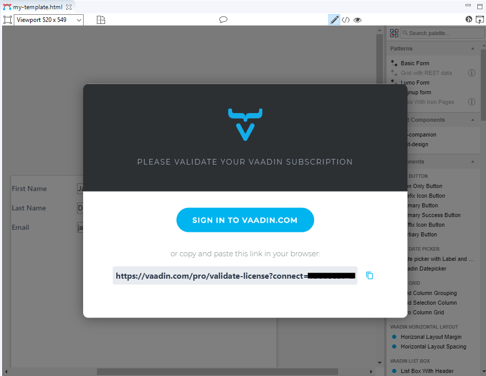

== Starting a Free Trial and Validating Your License

When you open Vaadin Designer for the first time, you need to log in to https://vaadin.com to validate your license:

- If you don't have an active subscription or trial: Click *Start free trial* and log in with your credentials.
This gives you access to Vaadin Designer, as well as other useful development tools, such as TestBench, Charts, CRUD, Grid Pro, and more. See the link:https://vaadin.com/pricing[Pricing page] for more details.

- If you have an active subscription or trial:
Click *Have a subscription?* and log in with your credentials.

[[figure.designer.licensing.flow]]
.Vaadin license dialog

A separate license key is required for each developer.
If you choose not to supply a license, you're unable to see your design.

If, for any reason, you need to remove or change a valid license, it's located in
[filename]`~/.vaadin/proKey` in Unix systems and
[filename]`C:\Users++\++[replaceable]#<username>#\.vaadin\proKey` in
Windows.
