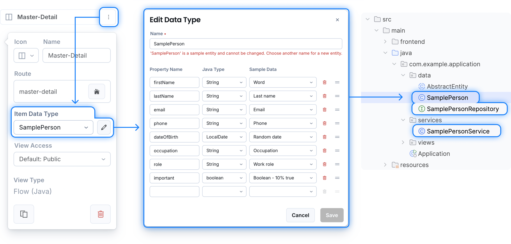
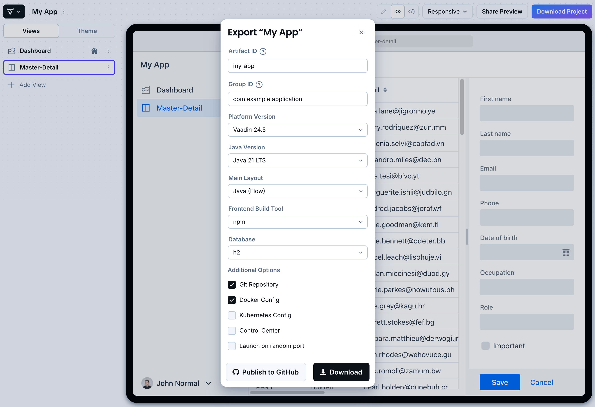

= Vaadin Start

The Vaadin Start online interface allows you to manage, configure and download the core of functional Vaadin projects. You can use them as a starting point to create your own Vaadin applications. Even more so, they allow you to do several fundamental things, easily.

image::_images/example-project.png[Project Built with Vaadin Start Online Interface]

https://start.vaadin.com?preset=latest[Open Vaadin Start, role="button primary water"]

== Manage Projects

With Vaadin Start, you can work on multiple projects. You can find a list of your projects in the `My Projects` section. You can download your project from there, directly.

.Projects List
image::_images/my-projects.png[height=75%, width=75%, List of Projects]

== Add Views

Vaadin Start allows you to add several views to your project. You can select the initial content of each view from a list of more than fifteen Flow and Hilla templates. For example, you can include views based on the Master-Detail template, which can be used to manage an entity's data.

The screenshot here shows the Vaadin Start UI with the Add View dialog open, showing the Master-Detail template selected:

.Master-Detail Template
image::_images/master-detail-template.png[Vaadin Start UI with Master-Detail Template Selected]

You can then add and modify JPA entities. These entities are downloaded with the generated project, along with their corresponding Spring Data classes, such as the [classname]`Repository` and [classname]`Service`. You can see the relevant parts highlighted in the screenshots here:

.Edit Data Entity
[.fill.white]

== Login & Access Control

You can also configure security and control access. A login view is added if you configure one or more views that require a logged-in user.

In this screenshot, you can see the Vaadin Start UI with the view details popover open, showing the options for the View Access control:

.View Access Control Setup
image::_images/security-setup.png[Vaadin Start UI with View Access Controls, width=60%]

== Customize Theme

Vaadin Start lets you easily change the look and feel of the application. Specifically, you can adjust the application's colors, typography, style, sizing, and spacing.

This next screenshot shows the Vaadin Start UI with the Theme sidebar active, showing the color palette options:

.Theme Customization
image::_images/customize-theming.png[Vaadin Start UI with Theme Color Palettes, width=40%]

== Technical Configuration

You can also add helpful project settings. For example, you can generate the deployment files for Docker, and Kubernetes. Or you can select between H2 and PostgreSQL as the database to use for the project.

This screenshot shows the Vaadin Start UI with the Download Project dialog open, with all of the project settings shown:

.Download Project Dialog

== Hello World Projects

To start with a simplified project template -- without adding and configuring any views -- you can configure and download a "Hello World" starter from the landing page of Vaadin Start.

This screenshot shows the configuration options for the Hello World starter:

.Hello World Starter

