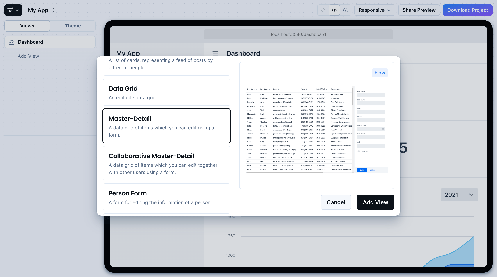
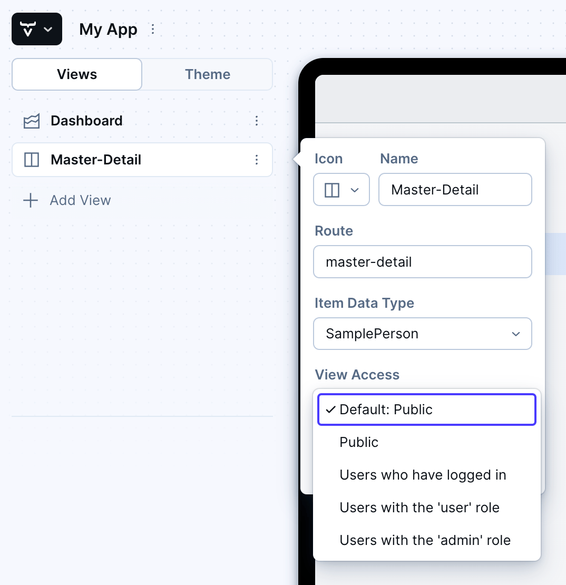

= Vaadin Start

image::_images/example-project.png[An example project built with the Vaadin Start online interface]

https://start.vaadin.com?preset=latest[Open Vaadin Start, role="button primary water"]

The Vaadin Start online interface allows you to configure and download the core of a functional Vaadin project. At a minimum, you can then use that project as a starting point to create your own Vaadin application. Even more so, it allows you easily to do several fundamental things.

== Add Views

First, Vaadin Start allows you to add several views to an application. You can select the initial content of each view from a list of more than fifteen templates. For example, you can include views based on the Master-Detail template, which can be used to manage an entity's data.

.Master-Detail Template

////
// TODO not available in Start at the moment
Next, you can add and modify JPA entities. These entities are downloaded with the generated project, along with their corresponding Spring Data classes, such as the [classname]`Repository` and [classname]`Service`.

image::_images/edit-entity.png[Edit Entities, width=100%]
////

== Login & Access Control

You can also set up security and configure access control. A login view is added automatically for you if you configure one or more views to require a logged-in user.
// TODO not possible at the moment
// This can be configured for a specific view, or for the entire application.

.View Access Control Setup

== Customize Theme

Vaadin Start lets you easily change the look and feel of the application. Specifically, you can adjust the application's colors, typography, style, sizing, and spacing.

.Theme Customization
image::_images/customize-theming.png[Vaadin Start UI, the Theme sidebar active, showing the color palette options, width=50%]

== Technical Configuration

Plus, you can add helpful project settings. For example, you can generate the deployment files for Docker and Kubernetes, or you can select between H2 and PostgreSQL as the database to use for the project.

.Download Project Dialog
image::_images/download-dialog.png[Vaadin Start UI with the Download Project dialog open, with all the project settings shown]

== Hello World Projects

If you want a simplified project template to start with, without adding and configuring any views, you can configure and download a “Hello World” starter from the landing page of Vaadin Start.

.Hello World Starters
image::_images/hello-world-starters.png[The configuration options for Hello World starters, width=50%]
