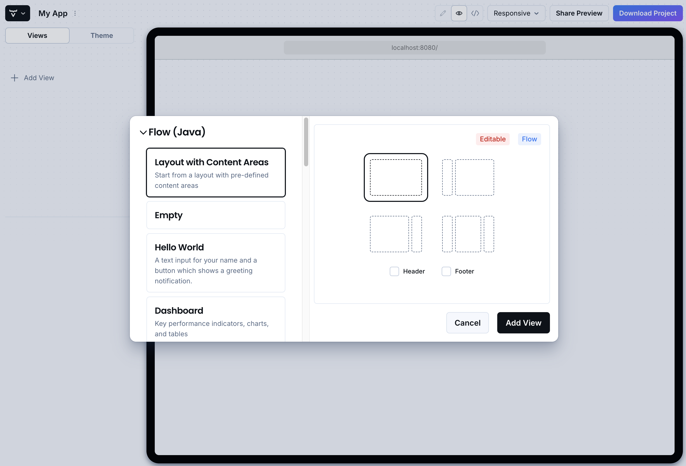
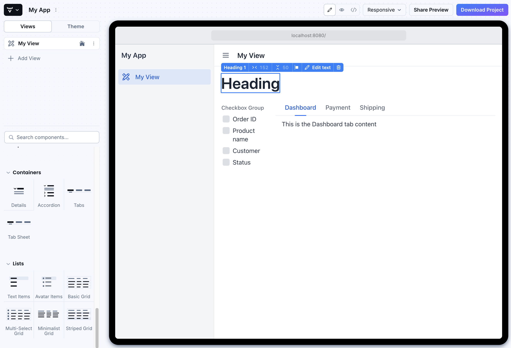
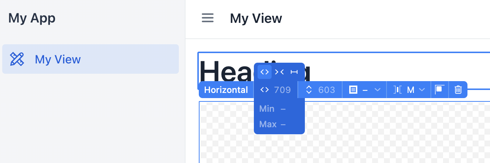
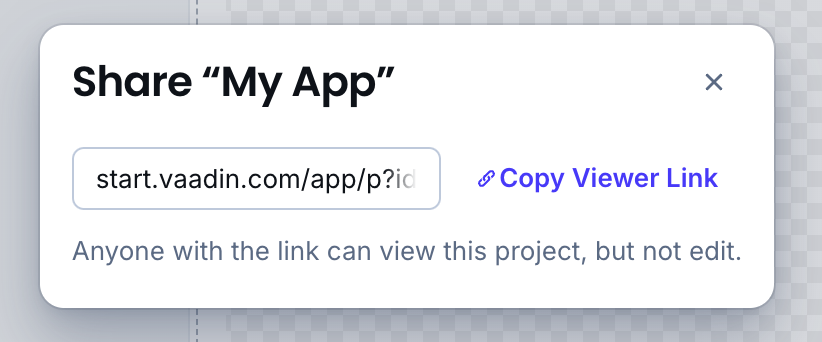
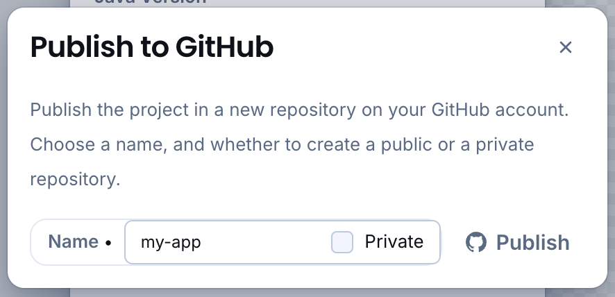

= Visual View Builder

Visual View Builder is a tool in the Vaadin Start application generator. It allows you to assemble custom views by dragging and dropping items into place. When you're done, you can download and run the application locally or share preview with others.

Visual View Builder generates the required code declarations, configurations, and sample data for your application.

.Theming & Other Features
[TIP]
Visual View Builder is part of Vaadin Start. You can customize the application theme, settings (e.g., Java version), and more before downloading or sharing the application.

== Creating a project with Custom View

Go to `https://start.vaadin.com` and start new project. After opening project, click [guibutton]*+ Add View*, choose [guilabel]*Layout with Content Areas* from the list and confirm. This opens View Builder.

=== Building a View

Drag items from the menu in the toolbar to the view (see the margin in the screenshot here). You can place content and add containers with some pre-made components.

=== Working with Layouts

If you want to place items in a row, for example, you can do so by dragging a `Horizontal Layout` component from the toolbar on the side and then add items to it. You can use options on popup toolbar to modify size and spacing of both layout and it's items.

Do the same instead with a `Vertical Layout` if you want the items arranged from top-to-bottom.

==== Deleting Items

If you're unhappy with an item or its placement, you can delete it by clicking the trash icon in the toolbar or just by pressing kbd:[Del].

== Sharing

Once you're ready, you can share the project with others either by copying the link to it and giving it to them, or by creating a GitHub repository for it. Click [guilabel]*Share Preview* to do so.

You can find publish to GitHub feature in [guibutton]*Download Project* dialog.

== Downloading the Project

When you're done with Visual View Builder and ready to generate the application, click [guibutton]*Download Project* in the top right-hand corner of the screen. Incidentally, you can add as many views as you want before downloading the project.

[discussion-id]`b9ce6c1a-050b-11ee-be56-0242ac120002`
