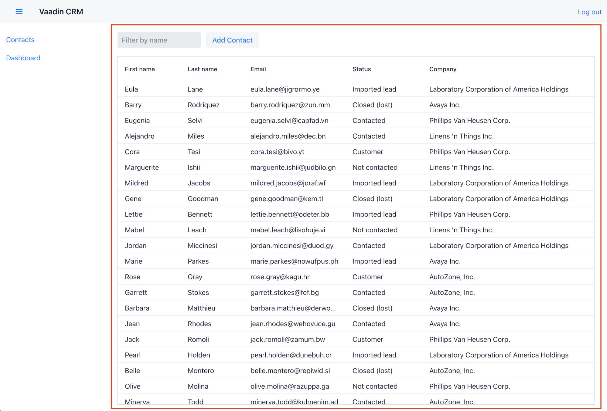

= Create a Vaadin Flow View with Components

Vaadin is a Java framework for building web applications. It has a component-based programming model that allows you to build user interfaces.

On this part, you'll learn core Vaadin concepts and scaffold the first view of the Custom Relationship Management (CRM) application. It covers Vaadin component basics and constructing a view with the Vaadin Flow Java API.

== Basic Elements

Before getting into the details of creating a view, it's important to understand the basic elements that you'll use.

=== Vaadin UI Components

Vaadin includes over forty <<{articles}/components#,UI components>> to help you build applications faster. By using ready-made building blocks, you're able to focus primarily on building end-user functionality.

Vaadin components are custom HTML elements that are registered with the browser. They are based on W3C web component standards. The components have light and dark themes that can be customized with CSS variables to fit your brand.

image::images/components-and-layouts/vaadin-components.png[A grid of Vaadin components]

You can create a new component by initializing a Java object. For instance, to create a `Button`, you would write something like this:

.Creating a Button
[source,java]
----
Button button = new Button("I'm a Button");
----

=== Layouts

Layouts decide how components are positioned in the browser window. The most common layout components are `HorizontalLayout`, `VerticalLayout`, and `Div`. The first two set the content orientation as horizontal or vertical, whereas `Div` lets you control the positioning with CSS.

`HorizontalLayout` and `VerticalLayout` have methods to align items on both the primary and the cross axis. For example, if you want all components, regardless of their height, to be aligned with the bottom of a `HorizontalLayout`, you can set the default alignment to `Alignment.END`.

Using this example, and the `add()` method to add components to layouts, you would do something like this:

.Setting layout alignment
[source,java]
----
Button button = new Button("I'm a button");
HorizontalLayout layout = new HorizontalLayout(button, new DatePicker("Pick a date"));

layout.setDefaultVerticalComponentAlignment(Alignment.END);
add(layout);
----

The result of the above is what you see in the screenshot here:

=== UI Events

You can add functionality to your application by listening to events. Events can include button clicks and value changes from select components.

This example adds the text "Clicked!" to the layout when the button is clicked:

.Listening to click events
[source,java]
----
button.addClickListener(clickEvent ->
  add(new Text("Clicked!")));
----

=== HTML

One unique Vaadin Flow feature is that you can build web applications entirely in Java, eliminating the need to write common HTML. This higher level of abstraction makes development more productive and debugging easier.

Vaadin does support HTML templates and customizing the code that runs in the browser. However, you don't usually have to worry about this.

== The Contact List View

The first view is the Contact list view. You can see how it looks in the screenshot here. It lists all contacts. Users can search, add, edit, and delete contacts in this view.

You'll focus initially only on the list view. You'll add a layout containing the header and sidebar later on the "Navigation & App Layout" part.

On this part and the next, you'll create the required layouts and components for the view. Then, on the part that follows, you'll create a service class for accessing the backend and populating the view with data.

Start by locating the `ListView.java` class under `src/main/java`. Then replace the contents of the file with the following:

.`ListView.java`
[source,java]
----
package com.example.application.views.list;

import com.example.application.data.entity.Contact;
import com.vaadin.flow.component.Component;
import com.vaadin.flow.component.button.Button;
import com.vaadin.flow.component.grid.Grid;
import com.vaadin.flow.component.orderedlayout.HorizontalLayout;
import com.vaadin.flow.component.orderedlayout.VerticalLayout;
import com.vaadin.flow.component.textfield.TextField;
import com.vaadin.flow.data.value.ValueChangeMode;
import com.vaadin.flow.router.PageTitle;
import com.vaadin.flow.router.Route;

@Route(value = "")
@PageTitle("Contacts | Vaadin CRM")
public class ListView extends VerticalLayout { // <1>
    Grid<Contact> grid = new Grid<>(Contact.class); // <2>
    TextField filterText = new TextField();

    public ListView() {
        addClassName("list-view"); // <10>
        setSizeFull();
        configureGrid(); // <3>

        add(getToolbar(), grid); // <4>
    }

    private void configureGrid() {
        grid.addClassNames("contact-grid"); // <10>
        grid.setSizeFull();
        grid.setColumns("firstName", "lastName", "email"); // <5>
        grid.addColumn(contact -> contact.getStatus().getName()).setHeader("Status"); // <6>
        grid.addColumn(contact -> contact.getCompany().getName()).setHeader("Company");
        grid.getColumns().forEach(col -> col.setAutoWidth(true)); // <7>
    }

    private HorizontalLayout getToolbar() {
        filterText.setPlaceholder("Filter by name...");
        filterText.setClearButtonVisible(true);
        filterText.setValueChangeMode(ValueChangeMode.LAZY); // <8>

        Button addContactButton = new Button("Add contact");

        var toolbar = new HorizontalLayout(filterText, addContactButton); // <9>
        toolbar.addClassName("toolbar"); // <10>
        return toolbar;
    }
}
----

The following are comments about the code before. The numbers reference the circled numbers at the end of various lines of code.

<1> The view extends `VerticalLayout`, which places all child components vertically.
<2> The Grid component is typed with `Contact`.
<3> The grid configuration is extracted to a separate method to keep the constructor easier to read.
<4> Add the toolbar and grid to the `VerticalLayout`.
<5> Define which properties of `Contact` the grid should show.
<6> Define custom columns for nested objects.
<7> Configure the columns to adjust automatically their size to fit their content.
<8> Configure the search field to fire value-change events only when the user stops typing. This way you avoid unnecessary database calls, but the listener is still fired without the user leaving the focus from the field.
<9> The toolbar uses a `HorizontalLayout` to place the `TextField` and `Button` next to each other.
<10> Adding some class names to components makes it easier to style the application later using CSS.

If your application is still running from the previous step, you only need to perform a build, either with the kbd:[Command+F9]/kbd:[Ctrl+F9] keyboard shortcut, or by pressing the "hammer" icon in the toolbar (see cropped screenshot). Vaadin automatically reloads your browser to display the changes.

image:images/components-and-layouts/build-project.png[The build project button is in the IntelliJ toolbar, width=300]

Incidentally, you can keep the server running throughout this tutorial. You only need to restart the server in a couple of instances. These are highlighted in the instructions.

You should now see the empty view structure in the browser window. In the next part, you'll build a component for the form that's used for editing contacts.

image::images/components-and-layouts/list-view-complete.png[The completed list view has all the components, but no data yet]

include::{root}/articles/tutorial/_ebook-banner.adoc[opts=optional]

[discussion-id]`79C51513-862E-47EC-829D-9A149C06F7A0`
