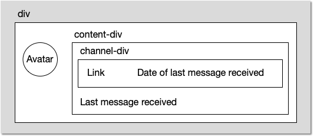

= Styling

The chat application is now fully functional, but it does not look very nice. In this part of the tutorial, you are going to tweak the look and feel of the application.

== Styling in Flow

So far in this tutorial, you have been using a theme called Lumo, which is the default theme in all Vaadin applications. It provides several utility CSS classes out of the box that can be added to your components and HTML elements to style them. In Java, these utility classes are available in the [classname]`LumoUtility` class.

However, there are cases that cannot be handled with utility classes alone. One such case could be when you need to use a different selector than just a classname. Another case could be a complex layout where semantic CSS makes more sense than using a lot of utility classes. In this case, you need to create a new theme.

*TODO Add links to styling documentation (in the process of being moved)*

== Create a theme

Create a new directory `frontend/themes/chat-theme`. Inside this directory, create an empty file `styles.css`. You will be adding `@import`:s to this file later in this tutorial step. Vaadin will automatically import the Lumo theme and apply your styles on top of the Lumo styles.

Next, you need to configure your application to use applu new theme. You do this by adding the `@Push` annotation to your application shell class or in this case, the [classname]`Application` class:

[source,java]
----
@SpringBootApplication
@Push
@Theme(value = "chat-theme") // <1>
public class Application implements AppShellConfigurator {
    // ...
}
----
<1> This is the new line to add.

== Improve the look and feel of the channel view

You are now going to improve the look and feel of the channel view by using some custom CSS and some Lumo utility classes. You are going to make the following improvements:

* Add a border around the message list.
* Adjust the padding of the message input so that it aligns with the message list.
* Add some spacing around the messages in the message list.
* Give different colors to the avatars of different authors.
* Show the current user's own messages in a different color.

Once finished, the styled view is going to look like this:

image::images/styled-channel-view.png[A web application with a listing of chat messages and an input field for posting new messages.]

Start by making some changes to the constructor of [classname]`ChannelView`.

[source,java]
----
private final String currentUserName; // <1>

public ChannelView(ChatService chatService, 
        AuthenticationContext authenticationContext) { // <2>
    this.chatService = chatService;
    currentUserName = authenticationContext.getPrincipalName().orElseThrow(); // <3>
    receivedMessages = new LimitedSortedAppendOnlyList<>(
        HISTORY_SIZE, 
        Comparator.comparing (Message::sequenceNumber)
    );

    setSizeFull();
    addClassName("channel-view"); // <4>

    messageList = new MessageList();
    messageList.addClassNames(LumoUtility.Border.ALL); // <5>
    messageList.setSizeFull();
    add(messageList);

    var messageInput = new MessageInput(event -> sendMessage(event.getValue()));
    messageInput.addClassNames(LumoUtility.Padding.NONE); // <6>
    messageInput.setWidthFull();

    add(messageInput);
}
----
<1> In order to know which messages are sent by the current user, you need to know the username of the current user.
<2> You need to inject an instance of `AuthenticationContext` in order to get the current username.
<3> Since `ChannelView` is protected, the authentication context is guaranteed to contain a principal name at the time of creation.
<4> You will be needing this for semantic CSS later.
<5> In this case, it is easier to use a Lumo utility class than to declare a semantic CSS classname.
<6> `MessageInput` by default has a padding. This is an easy way of disabling it.

`MessageListItem` has a property called `userColorIndex` that can take a value between 0 and 6. Every value corresponds to a different color of the user's avatar. This can come in handy when you do not have access to the users' actual avatars (such as photos) but still want to make different avatars easier to distinguish (and the user interface more colorful).

You are now going to set a color index based on the `hashCode` of the message author and also add a custom theme name to all messages that are written by the current user. 
Look up the [methodname]`createMessageListItem` method and change it as follows:

[source,java]
----
private MessageListItem createMessageListItem(Message message) {
    var item = new MessageListItem(
        message.message(), 
        message.timestamp(), 
        message.author()
    );
    item.setUserColorIndex(Math.abs(message.author().hashCode() % 7)); // <1>
    if (message.author().equals(currentUserName)) {
        item.addThemeNames("current-user"); // <2>
    }
    return item;
}
----
<1> This is a quick and dirty way of turning the author's username into an integer between 0 and 6.
<2> You will be referring to the `current-user` theme name in a CSS selector later.

You can find more information about `MessageList` styling in the <<{articles}/components/message-list/styling,component documentation>>.

You have now done all the changes needed on the Java side. Now it is time to move over to the CSS side. Start by creating a new file called `channel-view.css` in the `frontend/themes/chat-theme` directory, like this:

.`channel-view.css`
[source,css]
----
.channel-view vaadin-message { /* <1> */
    margin: var(--lumo-space-s);
}

.channel-view vaadin-message[theme~="current-user"] { /* <2> */
    border-radius: var(--lumo-border-radius-m);
    background-color: var(--lumo-contrast-5pct);
}
----
<1> This will add a small margin to every `MessageListItem` inside the `ChannelView`.
<2> This will add a radius and a darker background to every `MessageListItem` inside `ChannelView` that has been written by the current user.

Finally, you have to add `channel-view.css` to the theme. You do this by importing it into the `styles.css` file, like this:

.`styles.css`
[source,css]
----
@import url('channel-view.css');
----

== Improve the look and feel of the lobby view

Right now, the lobby is just showing a list of channels. However, if you look at the [classname]`Channel` objects returned by [classname]`ChatService`, you can see that the last message posted to the channel is also provided, including its author, timestamp and the message text itself. You are now going to change the view so that this information is also visible.

Once finished, the view is going to look like this:

image::images/styled-lobby-view.png[A web application with a listing of chat channels and an input field and button for creating new channels.]

In order to show all the channel information in a nice way, you are going to construct the following custom layout:

* The outer div contains the channel's avatar and an inner div, called the `content-div`.
* The `content-div` contains another div, called the `channel-div`, and the last message, if any.
* The `channel-div` contains a link to the channel and the date of the last message, if any.

Making a layout like this in HTML is quite easy. However, Flow also allows you to do this in 100% Java (even though the resulting code is more verbose). Furtherore, you can use Lumo utility classes to style the entire layout.

You are now going to try out building an HTML layout in Java. In [classname]`LobbyView`, look up the [methodname]`createChannelComponent` method and replace it with the following behemoth: 

[source,java]
----
private Component createChannelComponent(Channel channel) { // <1>
    var div = new Div();
    div.addClassNames(LumoUtility.Display.FLEX, LumoUtility.Gap.MEDIUM, 
        LumoUtility.Padding.MEDIUM, LumoUtility.BorderRadius.MEDIUM, 
        "channel"); // <2>

    var avatar = new Avatar(channel.name());
    avatar.setColorIndex(Math.abs(channel.id().hashCode() % 7)); // <3>
    div.add(avatar);

    var contentDiv = new Div();
    contentDiv.addClassNames(LumoUtility.Display.FLEX, LumoUtility.Flex.AUTO,
        LumoUtility.FlexDirection.COLUMN, LumoUtility.LineHeight.XSMALL, 
        LumoUtility.Gap.XSMALL);
    div.add(contentDiv);

    var channelDiv = new Div();
    channelDiv.addClassNames(LumoUtility.Display.FLEX, LumoUtility.AlignItems.BASELINE, 
        LumoUtility.JustifyContent.START, LumoUtility.Gap.SMALL);
    contentDiv.add(channelDiv);

    var channelLink = new RouterLink(channel.name(), ChannelView.class, channel.id()); // <4>
    channelLink.addClassNames(LumoUtility.FontSize.MEDIUM, LumoUtility.FontWeight.BOLD, 
        LumoUtility.TextColor.BODY);
    channelDiv.add(channelLink);

    if (channel.lastMessage() != null) {
        var lastMessageTimestamp = new Div(formatInstant(channel.lastMessage().timestamp(), getLocale()));
        lastMessageTimestamp.addClassNames(LumoUtility.FontSize.SMALL, LumoUtility.TextColor.SECONDARY);
        channelDiv.add(lastMessageTimestamp);
    }

    var lastMessage = new Div();
    lastMessage.addClassNames(LumoUtility.FontSize.SMALL, LumoUtility.TextColor.SECONDARY);
    contentDiv.add(lastMessage);
    if (channel.lastMessage() != null) {
        var author = new Span(channel.lastMessage().author());
        author.addClassNames(LumoUtility.FontWeight.BOLD);
        lastMessage.add(author, new Text(": " + truncateMessage(channel.lastMessage().message()))); // <5>
    } else {
        lastMessage.setText("No messages yet");
    }
    return div;
}
----
<1> Since this layout will only be used inside a single view, you are using composition inside a method to build it. If the layout was needed in multiple views, a better way would have been to turn it into a class of its own.
<2> The `channel` CSS classname will be used later when you add the final touch using CSS.
<3> You use the same trick here to turn the channel name into an integer between 0 and 6 as you did in [methodname]`ChannelView`.
<4> The link to the channel is now embedded inside a layout instead of being returned directly.
<5> Unless the documentation says otherwise, you do not have to worry about escaping special characters when building HTML using Flow's API - Flow will take care of that for you.

*TODO Would it have made more sense to style this with semantic CSS? Or could it be left as an exercie to the reader and an example of a case where using utility classes makes the code difficult to read?*

In order to make the code compile, you also have to add two helper methods: one method for truncating a message string and another for formatting an `Instant`. In this case, you can add these methods directly to [classname]`LobbyView` as they will only be used there. However, if they were to be needed in multiple views, a better way would have been to create a utility class and add them there.

[source,java]
----
private static String truncateMessage(String msg) {
    return msg.length() > 50 ? msg.substring(0, 50) + "..." : msg;
}

private static String formatInstant(Instant instant, Locale locale) {
    return DateTimeFormatter.ofLocalizedDateTime(FormatStyle.MEDIUM)
            .withLocale(locale)
            .format(ZonedDateTime.ofInstant(instant, ZoneId.systemDefault()));
}
----

You are now almost done with all the changes needed on the Java side. Before you can move over to the CSS side, you have to make one more addition to the constructor of [classname]`LobbyView`.

In order to be able to write proper CSS selectors, you have to add a semantic CSS classname to the top element of the view by adding this line:

[source,java]
----
addClassName("lobby-view");
----

While you are at it, add a border around the channel list as well:

[source,java]
----
channels.addClassNames(LumoUtility.Border.ALL, LumoUtility.Padding.SMALL);
----

Now it is time to move over to the CSS side to add a final touch: a hover effect for every channel in the list. 

Start by creating a new file called `lobby-view.css` in the `frontend/themes/chat-theme` directory, like this:

.`lobby-view.css`
[source,css]
----
.lobby-view .channel:hover {
    background-color: var(--lumo-contrast-5pct);
}
----

Finally, you have to add `lobby-view.css` to the theme. You do this by importing it into the `styles.css` file, like this:

.`styles.css`
[source,css]
----
@import url('channel-view.css');
@import url('lobby-view.css'); // <1>
----
<1> This is the new line to add.

== Try it out!

You are now ready to try out your new theme.

1. Start the application by running `./mvnw spring-boot:run`
2. Open your browser at http://localhost:8080/ and login as `alice`
3. Notice how the channel avatars have different colors
4. Open another browser window in incognito mode and login as `bob`
5. Navigate to the same channel in both windows
6. Send some messages in both windows. Notice how the author avatars show up with different colors.
7. Navigate back to the lobby view. Notice how the last message is visible in the channel list.
