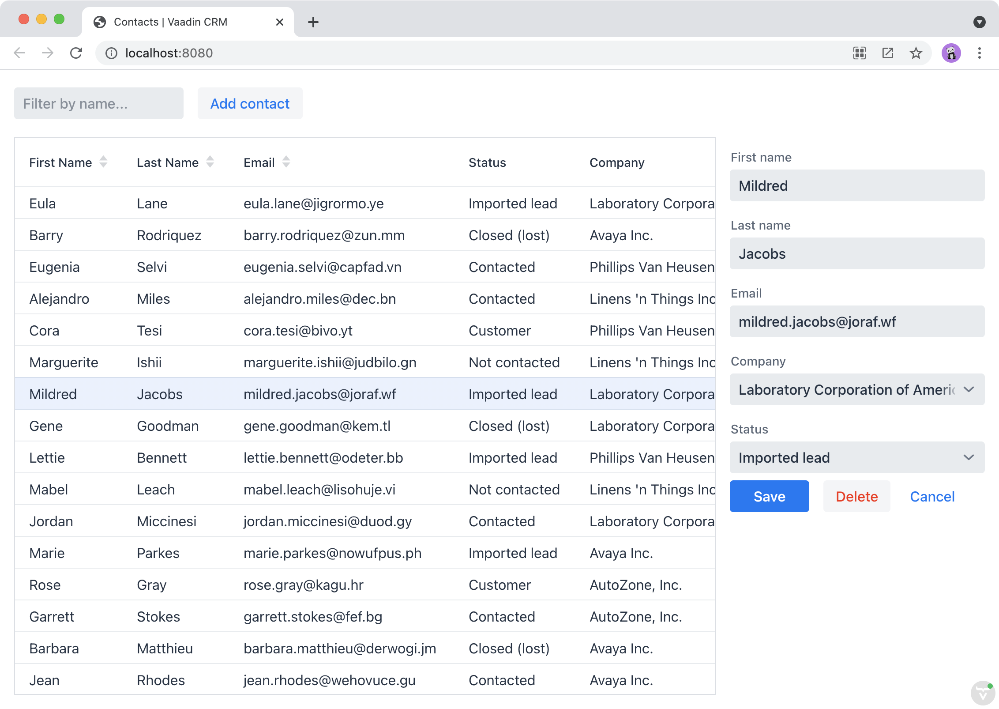
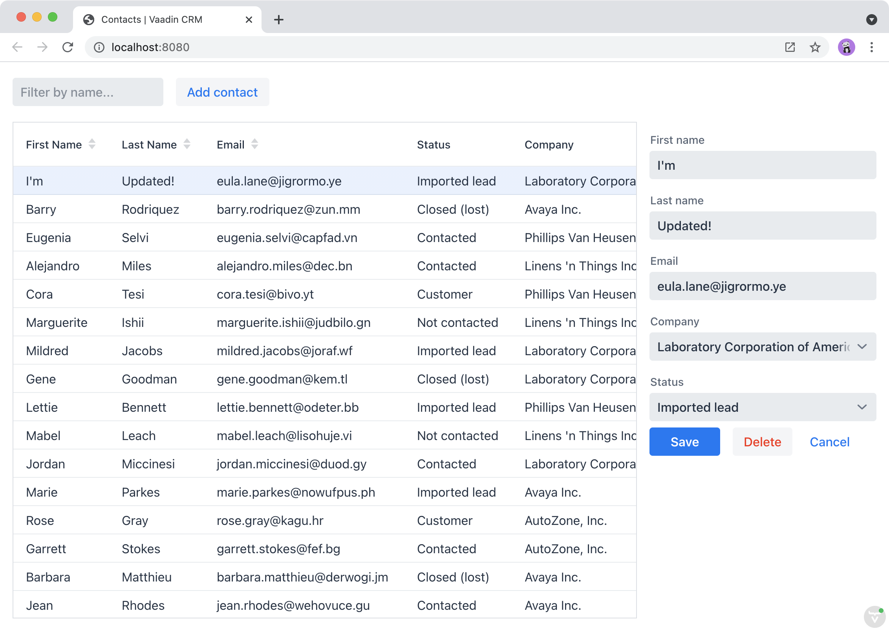

= Passing Data and Events between Vaadin Components

In the previous chapter, you created a reusable form component to edit contacts.
In this chapter, you hook it up to the rest of the view and manage the view state.
The form:

* shows the selected contact in the grid;
* is hidden when no contact is selected;
* saves and deletes contacts in the database.

== Showing the Selected Contact in the Form
// TODO this section should be enhanced, just simply replacing code, would be better to split into couple of insertions so that reader could follow what is happening here.
The first step is to show the selected grid row in the form.

To do this, update [classname]`ListView` as follows:

.`ListView.java`
[source,java]
----
package com.example.application.views.list;

import com.example.application.data.entity.Contact;
import com.example.application.data.service.CrmService;
import com.vaadin.flow.component.Component;
import com.vaadin.flow.component.button.Button;
import com.vaadin.flow.component.grid.Grid;
import com.vaadin.flow.component.orderedlayout.HorizontalLayout;
import com.vaadin.flow.component.orderedlayout.VerticalLayout;
import com.vaadin.flow.component.textfield.TextField;
import com.vaadin.flow.data.value.ValueChangeMode;
import com.vaadin.flow.router.PageTitle;
import com.vaadin.flow.router.Route;

@Route(value = "")
@PageTitle("Contacts | Vaadin CRM")
public class ListView extends VerticalLayout {
    Grid<Contact> grid = new Grid<>(Contact.class);
    TextField filterText = new TextField();
    ContactForm form;
    CrmService service;

    public ListView(CrmService service) {
        this.service = service;
        addClassName("list-view");
        setSizeFull();
        configureGrid();
        configureForm();

        add(getToolbar(), getContent());
        updateList();
        closeEditor(); // <1>
    }

    private HorizontalLayout getContent() {
        HorizontalLayout content = new HorizontalLayout(grid, form);
        content.setFlexGrow(2, grid);
        content.setFlexGrow(1, form);
        content.addClassNames("content");
        content.setSizeFull();
        return content;
    }

    private void configureForm() {
        form = new ContactForm(service.findAllCompanies(), service.findAllStatuses());
        form.setWidth("25em");
    }

    private void configureGrid() {
        grid.addClassNames("contact-grid");
        grid.setSizeFull();
        grid.setColumns("firstName", "lastName", "email");
        grid.addColumn(contact -> contact.getStatus().getName()).setHeader("Status");
        grid.addColumn(contact -> contact.getCompany().getName()).setHeader("Company");
        grid.getColumns().forEach(col -> col.setAutoWidth(true));

        grid.asSingleSelect().addValueChangeListener(event ->
            editContact(event.getValue())); // <2>
    }

    private Component getToolbar() {
        filterText.setPlaceholder("Filter by name...");
        filterText.setClearButtonVisible(true);
        filterText.setValueChangeMode(ValueChangeMode.LAZY);
        filterText.addValueChangeListener(e -> updateList());

        Button addContactButton = new Button("Add contact");
        addContactButton.addClickListener(click -> addContact()); // <3>

        var toolbar = new HorizontalLayout(filterText, addContactButton);
        toolbar.addClassName("toolbar");
        return toolbar;
    }

    public void editContact(Contact contact) { // <4>
        if (contact == null) {
            closeEditor();
        } else {
            form.setContact(contact);
            form.setVisible(true);
            addClassName("editing");
        }
    }

    private void closeEditor() {
        form.setContact(null);
        form.setVisible(false);
        removeClassName("editing");
    }

    private void addContact() { // <5>
        grid.asSingleSelect().clear();
        editContact(new Contact());
    }

    private void updateList() {
        grid.setItems(service.findAllContacts(filterText.getValue()));
    }
}
----
<1> The [methodname]`closeEditor()` call at the end of the constructor:
* sets the form contact to `null`, clearing out old values;
* hides the form;
* removes the `"editing"` CSS class from the view.
<2> [methodname]`addValueChangeListener()` adds a listener to the grid.
The `Grid` component supports multi- and single-selection modes.
You only need to select a single `Contact`, so you can use the [methodname]`asSingleSelect()` method.
The [methodname]`getValue()` method returns the `Contact` in the selected row, or null if there is no selection.
<3> Call [methodname]`addContact()` when the user clicks on the "Add contact" button.
<4> [methodname]`editContact()` sets the selected contact in the [classname]`ContactForm` and hides or shows the form, depending on the selection.
It also sets the `"editing"` CSS class name when editing.
<5> [methodname]`addContact()` clears the grid selection and creates a new `Contact`.

Build the application.
You should now be able to select contacts in the grid and see them in the form.
But, none of the buttons work yet.

== Handling Form Events

pass:[<!-- vale Vaadin.So = NO -->]

The [classname]`ContactForm` API is designed to be reusable; it's configurable through properties and it fires the necessary events.
So far, you have passed a list of companies, statuses, and the contact to the form.
Now, all you need to do is listen for the events to complete the integration.

pass:[<!-- vale Vaadin.So = YES -->]

To handle event listeners, update [methodname]`configureForm()` and add [methodname]`saveContact()` and [methodname]`deleteContact()` methods.

.`ListView.java`
[source,java]
----
private void configureForm() {
    form = new ContactForm(service.findAllCompanies(), service.findAllStatuses());
    form.setWidth("25em");
    form.addSaveListener(this::saveContact); // <1>
    form.addDeleteListener(this::deleteContact); // <2>
    form.addCloseListener(e -> closeEditor()); // <3>
}

private void saveContact(ContactForm.SaveEvent event) {
    service.saveContact(event.getContact());
    updateList();
    closeEditor();
}

private void deleteContact(ContactForm.DeleteEvent event) {
    service.deleteContact(event.getContact());
    updateList();
    closeEditor();
}
----
<1> The save event listener calls [methodname]`saveContact()`.
It:
.. Uses `contactService` to save the contact in the event to the database.
.. Updates the list.
.. Closes the editor.
<2> The delete event listener calls [methodname]`deleteContact()`. It:
.. uses `contactService` to delete the contact from the database;
.. updates the list;
.. closes the editor.
<3> The close event listener closes the editor.

Build the application and verify that you are now able to select, add, update, and delete contacts.

== Making the Layout Responsive

Now if you try the UI with a mobile device or make your desktop browser really narrow, you will see that the UI is not currently very well optimised for small screens.
It usually makes sense to hide certain UI elements for smaller screens.
You can accomplish this using Java code or with CSS media queries.

Here we do it with CSS and utilise the class names we have previously added to our components.
Add the following CSS to [filename]`frontend/themes/flowcrmtutorial/styles.css`:

.`styles.css`
[source,css]
----
@media all and (max-width: 1100px) {
  .list-view.editing .toolbar,
  .list-view.editing .contact-grid {
    display: none;
  }
}
----

The CSS media query hides the grid and the toolbar when you are editing contacts on a narrow screen.

include::{root}/articles/tutorial/_ebook-banner.adoc[opts=optional]

[discussion-id]`7ADFAE2F-44BD-4EE2-A8E1-E8B49581856B`
