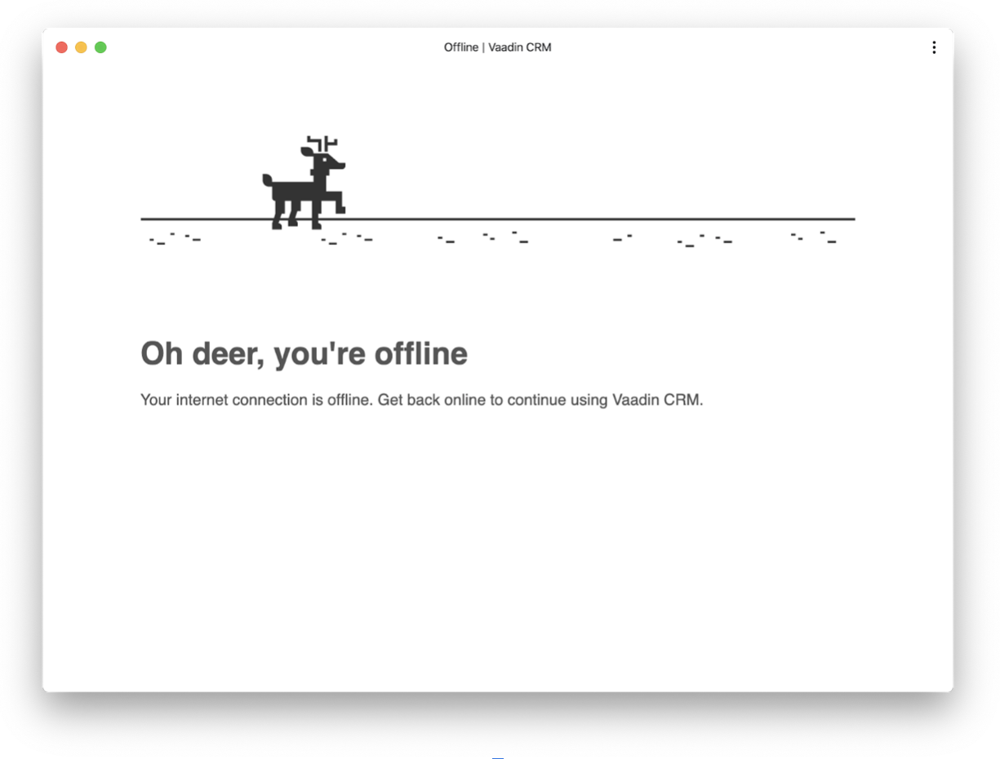

= Make a Vaadin Flow Application an Installable PWA

On this part of this tutorial, you'll turn the completed Customer Relationship Management (CRM) application into a Progressive Web Application (PWA), so that users can install it.

== Understanding PWAs

The term PWA is used to describe modern web applications that offer a user experience similar to a native application. PWA technologies make applications faster, more reliable, and more engaging.

PWAs can be installed on most mobile devices and on desktops when using supported browsers. They can even be listed in the Microsoft Store and Google Play Store. You can learn more about the underlying technologies and features in the <<{articles}/configuration/pwa#, PWA configuration>> documentation.

Two main components enable PWA technologies:

* ServiceWorker: a JavaScript worker file that controls network traffic and enables custom cache control.
* Web application manifest: a JSON file that identifies the web application as an installable application.

== PWA Resources

Vaadin provides the `@PWA` annotation, which automatically generates the required PWA resources. Add the `@PWA` annotation on [classname]`Application.java` as follows:

.`Application.java`
[source,java]
----
@SpringBootApplication
@Theme(value = "flowcrmtutorial")
@PWA( // <1>
    name = "Vaadin CRM", // <2>
    shortName = "CRM" // <3>
)
public class Application extends SpringBootServletInitializer implements AppShellConfigurator {

    public static void main(String[] args) {
        SpringApplication.run(Application.class, args);
    }

}
----
<1> The `@PWA` annotation tells Vaadin to create a `ServiceWorker` and a manifest file.
<2> `name` is the full name of the application for the manifest file.
<3> `shortName` should be short enough to fit under an icon when installed, and shouldn't exceed 12 characters.

=== Application Icon

You can override the default icon by replacing `src/main/resources/META-INF/resources/icons/icon.png` with another 512px &times; 512px PNG icon.

You can use your own icon, or save a https://github.com/vaadin/docs/raw/latest/articles/tutorial/images/pwa/icon.png[sample image], by right-clicking the link and selecting *Save Link As*. Be sure to have the file in PNG format.

== Customize Offline Page

Vaadin creates a generic offline fallback page that displays when the application is launched offline. You can make your application appear more polished by replacing this default page with a custom page that follows your own design guidelines.

Use the code below to create [filename]`offline.html` in the `src/main/resources/META-INF/resources` folder:

.`offline.html`
[source,html]
----
<!DOCTYPE html>
<html lang="en">
<head>
    <meta charset="UTF-8"/>
    <meta name="viewport" content="width=device-width, initial-scale=1.0"/>
    <meta http-equiv="X-UA-Compatible" content="ie=edge"/>
    <title>Offline | Vaadin CRM</title>
    
</head>
<body>

    
    <h1>Oh deer, you're offline</h1>
    
Your internet connection is offline. Get back online to continue using Vaadin CRM.

</body>
</html>
----

<1> The JavaScript snippet reloads the page if the browser detects that it's back online.

Add the following image -- or use one of your own -- to the `META-INF/resources/images` folder and name it [filename]`offline.png`.

image::images/pwa/offline.png[example offline image]

You can make the files available offline by adding them to the `@PWA` annotation in [classname]`Application` as follows:

.`Application.java`
[source,java]
----
@PWA(
    name = "VaadinCRM",
    shortName = "CRM",
    offlinePath="offline.html",
    offlineResources = { "./images/offline.png"} // <1>
)
----
<1> `offlineResources` is a list of files that Vaadin makes available offline through the `ServiceWorker`.

Now, restart the application. You can install it on supported browsers.

== Test Offline Page

Shut down the server in IntelliJ and refresh the browser -- or launch the installed application. You should now see the custom offline page.

On the next part of this tutorial, you'll add both unit tests and in-browser tests to the application.

include::{root}/articles/tutorial/_ebook-banner.adoc[opts=optional]

[discussion-id]`2861D7D6-5025-4A8B-A866-38C01AF5FF91`
