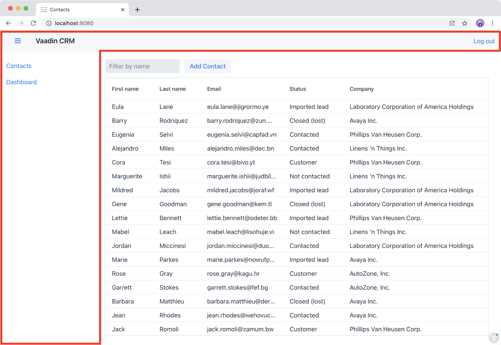
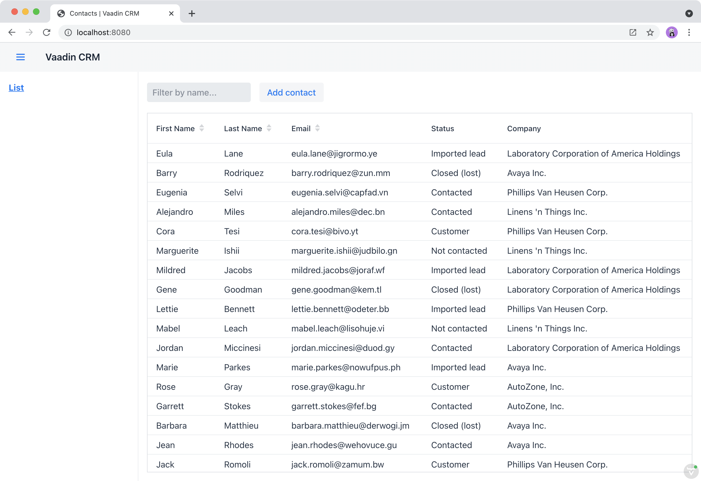
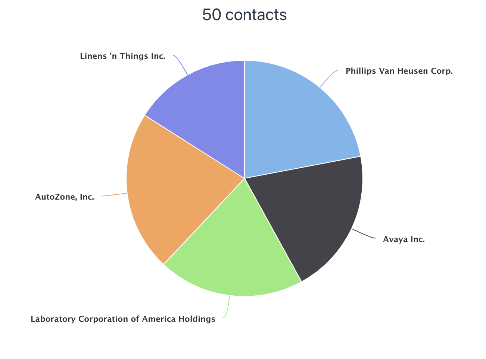
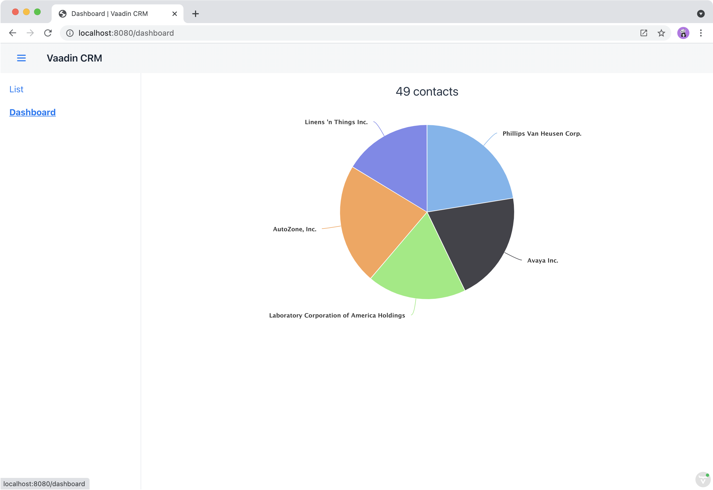

= Navigating among Views in Vaadin

pass:[<!-- vale Vaadin.So = NO -->]

So far in this tutorial series, you've built a Customer Relationship Management (CRM) application for listing and editing contacts. Now, you'll add a dashboard view to the application. You'll also add a responsive application layout, with a header and a navigation sidebar that can be toggled on small screens (see the screenshot here).

pass:[<!-- vale Vaadin.So = YES -->]

== View Routes

You can make any Vaadin component a navigation target by adding an `@Route("<path>")` annotation. Routes can be nested by defining the parent layout in the annotation: `@Route(value = "list", layout=MainLayout.class)`.

== Parent Layout

The application should have a shared parent layout with two child views. The first, `MainLayout`: App Layout should have a header and navigation: `ListView`: the default view, mapped to `""`; and `DashboardView`: mapped to `"dashboard"`. The second child should have a responsive application layout and navigation links.

Begin by creating a new Java class named [classname]`MainLayout` in the `views` package with the following content. This is the shared parent layout of both views in the application.

.`MainLayout.java`
[source, java]
----
package com.example.application.views;

import com.example.application.views.list.ListView;
import com.vaadin.flow.component.applayout.AppLayout;
import com.vaadin.flow.component.applayout.DrawerToggle;
import com.vaadin.flow.component.html.H1;
import com.vaadin.flow.component.orderedlayout.FlexComponent;
import com.vaadin.flow.component.orderedlayout.HorizontalLayout;
import com.vaadin.flow.component.orderedlayout.VerticalLayout;
import com.vaadin.flow.router.HighlightConditions;
import com.vaadin.flow.router.RouterLink;
import com.vaadin.flow.server.PWA;

public class MainLayout extends AppLayout { // <1>

    public MainLayout() {
        createHeader();
        createDrawer();
    }

    private void createHeader() {
        H1 logo = new H1("Vaadin CRM");
        logo.addClassNames(
            LumoUtility.FontSize.LARGE,
            LumoUtility.Margin.MEDIUM);

        HorizontalLayout header = new HorizontalLayout(
          new DrawerToggle(), // <2>
          logo
        );

        header.setDefaultVerticalComponentAlignment(FlexComponent.Alignment.CENTER); // <3>
        header.setWidth("100%");
        header.addClassNames(
            LumoUtility.Padding.Vertical.NONE,
            LumoUtility.Padding.Horizontal.MEDIUM);

        addToNavbar(header); // <4>

    }

    private void createDrawer() {
        RouterLink listLink = new RouterLink("List", ListView.class); // <5>
        listLink.setHighlightCondition(HighlightConditions.sameLocation()); // <6>

        addToDrawer(new VerticalLayout( // <7>
            listLink
        ));
    }
}
----
<1> `AppLayout` is a Vaadin layout with a header and a responsive drawer.
<2> `DrawerToggle` is a menu button that toggles the visibility of the sidebar.
<3> Centers the components in the `header` along the vertical axis.
<4> Adds the `header` layout to the application layout's nav bar, the section at the top of the screen.
<5> Creates a `RouterLink` with the text "List" and `ListView.class` as the destination view.
<6> Sets [methodname]`setHighlightCondition(HighlightConditions.sameLocation())` to avoid highlighting the link for partial route matches. Technically, every route starts with an empty route. Without this, it would always appear as active, even though the user isn't on the view.
<7> Wraps the link in a `VerticalLayout` and adds it to the `AppLayout` drawer.

Next, add the following CSS to [filename]`frontend/themes/flowcrmtutorial/styles.css` to highlight the selected link:

.`styles.css`
[source,css]
----
a[highlight] {
    font-weight: bold;
    text-decoration: underline;
}
----

Lastly, in [classname]`ListView`, update the `@Route` mapping to use the new `MainLayout` like so:

.`ListView.java`
[source,java]
----
@Route(value="", layout = MainLayout.class) // <1>
@PageTitle("Contacts | Vaadin CRM")
public class ListView extends VerticalLayout {
     ...
}
----
<1> [classname]`ListView` still matches the empty path, but now uses `MainLayout` as its parent.

Now you're ready to run the application. When you do, you should now see a header and a sidebar on the list view.

== Dashboard View

Next, you will create a new dashboard view. This view will show some basic statistics: the number of contacts in the system, and a pie chart of the number of contacts per company.

Now create a new Java class named [classname]`DashboardView` in the `views` package with the following content:

.`DashboardView.java`
[source,java]
----
package com.example.application.views;

import com.example.application.data.service.CrmService;
import com.vaadin.flow.component.Component;
import com.vaadin.flow.component.charts.Chart;
import com.vaadin.flow.component.charts.model.ChartType;
import com.vaadin.flow.component.charts.model.DataSeries;
import com.vaadin.flow.component.charts.model.DataSeriesItem;
import com.vaadin.flow.component.html.Span;
import com.vaadin.flow.component.orderedlayout.VerticalLayout;
import com.vaadin.flow.router.PageTitle;
import com.vaadin.flow.router.Route;

@Route(value = "dashboard", layout = MainLayout.class) // <1>
@PageTitle("Dashboard | Vaadin CRM")
public class DashboardView extends VerticalLayout {
    private final CrmService service;

    public DashboardView(CrmService service) { // <2>
        this.service = service;
        addClassName("dashboard-view");
        setDefaultHorizontalComponentAlignment(Alignment.CENTER); // <3>
        add(getContactStats(), getCompaniesChart());
    }

    private Component getContactStats() {
        Span stats = new Span(service.countContacts() + " contacts"); // <4>
        stats.addClassNames(
            LumoUtility.FontSize.XLARGE,
            LumoUtility.Margin.Top.MEDIUM);
        return stats;
    }

    private Chart getCompaniesChart() {
        Chart chart = new Chart(ChartType.PIE);

        DataSeries dataSeries = new DataSeries();
        service.findAllCompanies().forEach(company ->
            dataSeries.add(new DataSeriesItem(company.getName(), company.getEmployeeCount()))); // <5>
        chart.getConfiguration().setSeries(dataSeries);
        return chart;
    }
}
----
<1> [classname]`DashboardView` is mapped to the `"dashboard"` path and uses `MainLayout` as a parent layout.
<2> Takes [classname]`CrmService` as a constructor parameter and saves it as a field.
<3> Centers the contents of the layout.
<4> Calls the service to get the number of contacts.
<5> Calls the service to get all companies, then creates a [classname]`DataSeriesItem` for each, containing the company name and employee count.

.Vaadin Charts is a Commercial Component Set
[NOTE]
====
<<{articles}/components/charts#,Vaadin Charts>> is a collection of data visualization components that's a part of the https://vaadin.com/pricing[Vaadin Pro subscription]. Vaadin Charts comes with a free trial that you can activate in the browser. All Vaadin Pro tools and components are free for students through the https://education.github.com/pack?utm_source=github+vaadin[GitHub Student Developer Pack].
====

Open [filename]`Company.java` and add the following field and getter to get the employee count without having to fetch all of the entities.

.`Company.java`
[source,java]
----
@Formula("(select count(c.id) from Contact c where c.company_id = id)") // <1>
private int employeeCount;

public int getEmployeeCount(){
    return employeeCount;
}
----
<1> The Formula gets the count of employees without needing to fetch all of the employees.

== Dashboard View in Main Layout Sidebar

To include a dashboard view in the main layout sidebase, add a navigation link to [classname]`DashboardView` in the `MainLayout` drawer:

.`MainLayout.java`
[source,java]
----
private void createDrawer() {
    RouterLink listLink = new RouterLink("List", ListView.class);
    listLink.setHighlightCondition(HighlightConditions.sameLocation());

    addToDrawer(new VerticalLayout(
        listLink,
        new RouterLink("Dashboard", DashboardView.class)
    ));
}
----

Build and run the application again. You should now be able to navigate to the dashboard view and see stats on your CRM contacts. If you want, add or remove contacts in the list view to see that the dashboard reflects your changes.

On the next page, you'll secure the application by adding a log-in screen.

include::{root}/articles/tutorial/_ebook-banner.adoc[opts=optional]

[discussion-id]`52AFFD31-EA40-4AEF-B60F-E3BB6E5A8379`
