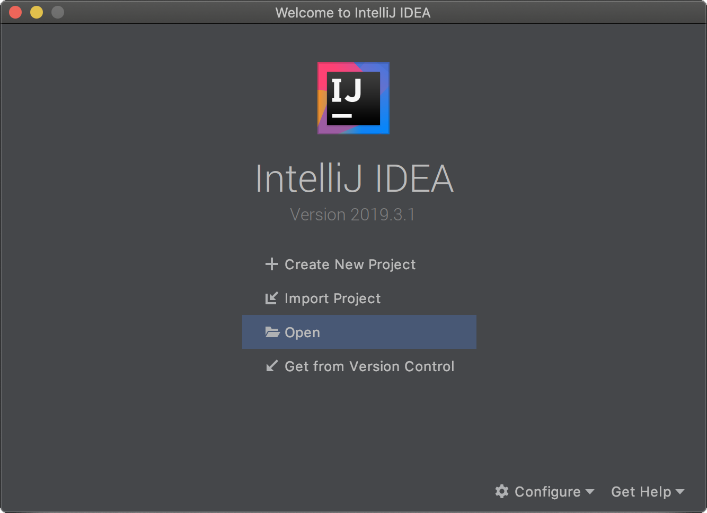
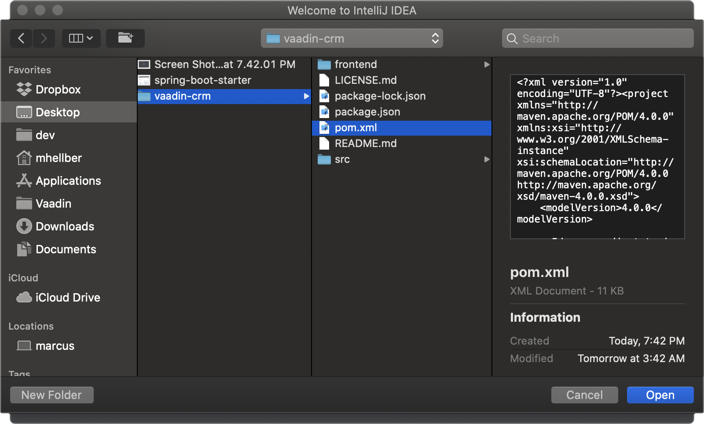
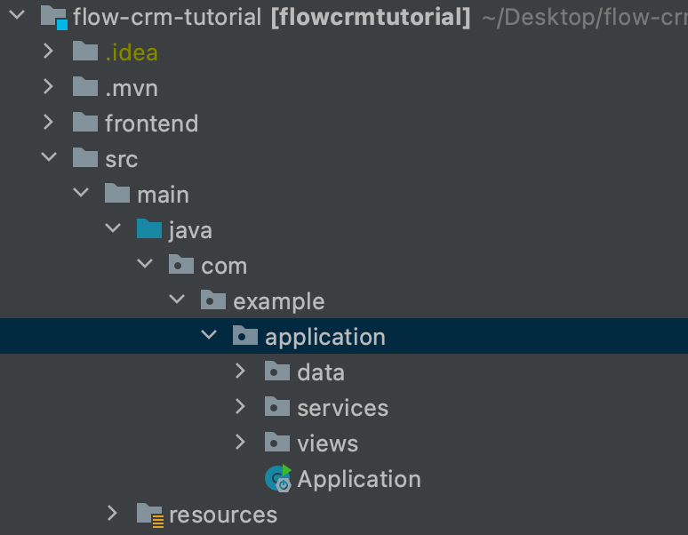
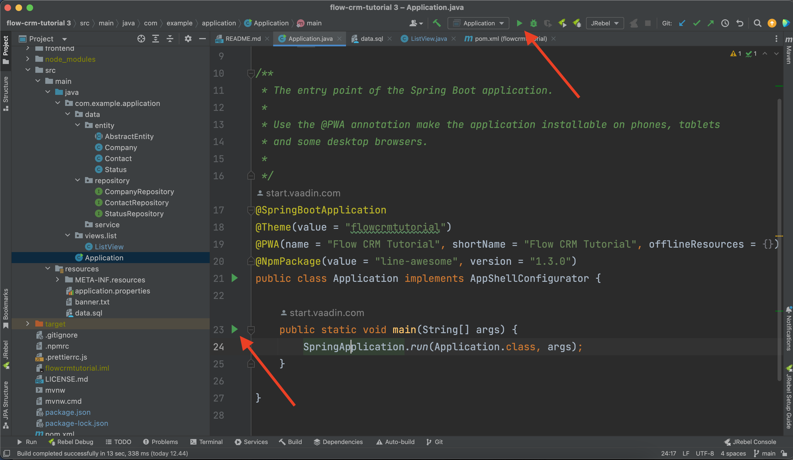
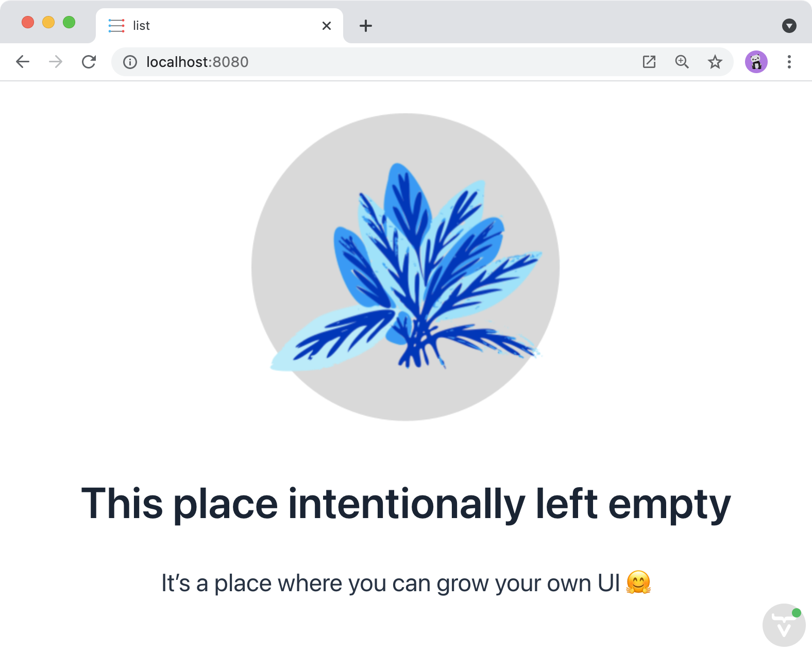

= Vaadin Flow Project Setup

This part of this tutorial covers downloading a Vaadin application starter, and importing a Vaadin Maven project in IntelliJ. Plus, it explains how to configure IntelliJ for productive development.

== Download Vaadin Application Starter

This tutorial uses a pre-configured starter from Vaadin Start. The starter application includes a few essential items:

- JPA data model consisting of `Contact`, `Company`, and `Status` JPA entities;
- Spring Data repositories for persisting and retrieving the entities from an embedded H2 database;
- [filename]`data.sql` file containing some test data;
- Single, empty view; and a
- Dockerfile.

To begin, download the starter application, which is a zip file. You can find it here:

ifdef::print[]
https://start.vaadin.com/dl?preset=flow-crm-tutorial&preset=partial-prerelease
endif::[]

ifndef::print[]
https://start.vaadin.com/dl?preset=flow-crm-tutorial&preset=partial-latest[Download starter,role="button primary water flow-tutorial-download-project"]
endif::[]

== Import a Maven Project into IntelliJ

Having downloaded the zip archive file, you'll first have to extract it somewhere. Any directory is fine: don't extract it, though, to the download folder since you might unintentionally delete your project later when clearing out old downloads.

In IntelliJ, select [guibutton]*Open* in the Welcome screen or [guilabel]*File* menu, as you can see in the screenshot here:

Next, from the directory tree that is displayed, find the folder where you extracted the files. Select the [filename]`pom.xml` file and click the *Open* button.

Select [guilabel]*Open as Project* from the dialog, as seen in the following screenshot:

image::images/setup/open-as-project.png[open as project]

This imports the project based on the [filename]`pom.xml` file. IntelliJ then imports the project and downloads all necessary dependencies. It can take several minutes, depending on the internet connection speed.

When the import is complete, your project structure should look as seen in the screenshot here:

Notice that the Java source files are in the `src/main/java` folder.

== Run a Spring Boot Project in IntelliJ

Spring Boot makes it easier to run a Java web application because it handles starting and configuring the server.

To run your application, run the Application class that contains the `main()` method that starts Spring Boot. IntelliJ detects automatically that you have a class with a `main()` method and displays it in the *run configurations* drop-down.

To start your application, open `Application.java` and click the play button next to the code line containing the `main()` method.

After you've run the application once from the `main()` method, it will appear in the [guilabel]*run configurations* drop-down in the main toolbar (see screenshot). On subsequent runs, you can run the application from there.

The first time you start a Vaadin application, it downloads frontend dependencies and builds a JavaScript bundle. IntelliJ indexes all the added dependencies. It won't need to do that when run subsequently.

You'll know that your application has started when you see output in the console similar to what you see here:

----
Tomcat started on port(s): 8080 (http) with context path ''
----

The development mode in Vaadin also opens a browser window for you automatically. You'll see a content placeholder and image similar to the screenshot here:

[.device]

== Enable Auto Import in IntelliJ

You can configure IntelliJ to resolve imports automatically for Java classes. This makes it easier to copy code from this tutorial into your IDE.

To enable auto import in IntelliJ, open the *Preferences/Settings* window and navigate to *Editor &rarr; General &rarr; Auto Import*.

From there, you can enable the following two options: *Add unambiguous imports on the fly*; and *Optimize imports on the fly*. You can see the checkboxes for these choices in the screenshot here:

image::images/setup/auto-import.png[automatic import settings]

Vaadin shares many class names (e.g., Button) with Swing, Java Abstract Window Toolkit (AWT), and JavaFX.

If you don't use Swing, AWT, or JavaFX in other projects, add the following packages to the *Exclude from import and completion* list to help IntelliJ select the correct classes, automatically:

- `com.sun`
- `java.awt`
- `javafx.scene`
- `javax.swing`
- `jdk.internal`
- `sun.plugin`

Now that you have a working development environment, you're ready to start building a web application.

include::{root}/articles/tutorial/_ebook-banner.adoc[opts=optional]

[discussion-id]`3C607714-1A52-49F0-9CB6-809F7A59F608`

++++

++++