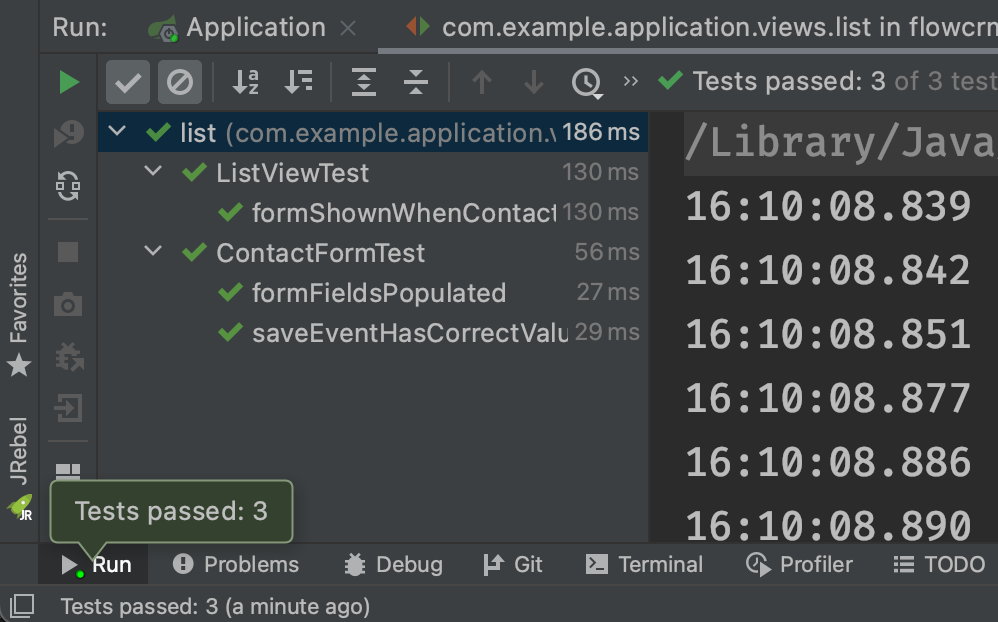

= Unit & Integration Tests

It's a common and best practice to test as little code as possible in a single test. This way, when things go wrong, only relevant tests fail. It makes it easier to troubleshoot.

For UI testing, there are three main approaches:

* Unit tests for simple UI logic.
* Integration tests for more advanced UI logic.
* End-to-end tests to check what the user sees.

You can run unit and integration tests as a standalone, that is, without any external dependencies, such as a running server or database.

End-to-end tests require the application to be deployed. They're run in a browser window to simulate an actual user.

On this part of this tutorial, you'll write and run unit and integration tests. End-to-end tests are covered on the next part.

== Unit Tests for Simple UI Logic

The most minimal way of testing is to create a plain Java unit test. This only works with UI classes with no dependencies, no auto-wiring, etc. For the [classname]`ContactForm`, you can create a unit test to verify that the form fields are correctly populated, based on the given bean.

.Put tests in the correct folder
[NOTE]
====
All test classes should go in the test folder, `src/test/java`. Pay special attention to the package names. Use package access for class fields. If the test isn't in the same package as the class you're testing, you'll get errors.
====

Now, create a new folder, `src/test/java`. In IntelliJ, right-click on the folder and select **Mark Directory as &rarr; Test Sources Root**. In the new folder, create a new package, `com.example.application.views.list`, and add a new [filename]`ContactFormTest.java` file with the following code:

.`ContactFormTest.java`
[source,java]
----
package com.example.application.views.list;

import com.example.application.data.entity.Company;
import com.example.application.data.entity.Contact;
import com.example.application.data.entity.Status;

import java.util.ArrayList;
import java.util.List;
import java.util.concurrent.atomic.AtomicReference;
import static org.junit.jupiter.api.Assertions.assertEquals;
import org.junit.jupiter.api.BeforeEach;
import org.junit.jupiter.api.Test;

public class ContactFormTest {
    private List<Company> companies;
    private List<Status> statuses;
    private Contact marcUsher;
    private Company company1;
    private Company company2;
    private Status status1;
    private Status status2;

    @BeforeEach  // <1>
    public void setupData() {
        companies = new ArrayList<>();
        company1 = new Company();
        company1.setName("Vaadin Ltd");
        company2 = new Company();
        company2.setName("IT Mill");
        companies.add(company1);
        companies.add(company2);

        statuses = new ArrayList<>();
        status1 = new Status();
        status1.setName("Status 1");
        status2 = new Status();
        status2.setName("Status 2");
        statuses.add(status1);
        statuses.add(status2);

        marcUsher = new Contact();
        marcUsher.setFirstName("Marc");
        marcUsher.setLastName("Usher");
        marcUsher.setEmail("marc@usher.com");
        marcUsher.setStatus(status1);
        marcUsher.setCompany(company2);
    }
}
----
<1> The `@BeforeEach` annotation adds dummy data that's used for testing. This method is executed before each `@Test` method.

Now, add a test method that uses [classname]`ContactForm`:

.`ContactFormTest.java`
[source,java]
----
@Test
public void formFieldsPopulated() {
    ContactForm form = new ContactForm(companies, statuses);
    form.setContact(marcUsher); // <1>
    assertEquals("Marc", form.firstName.getValue());
    assertEquals("Usher", form.lastName.getValue());
    assertEquals("marc@usher.com", form.email.getValue());
    assertEquals(company2, form.company.getValue());
    assertEquals(status1, form.status.getValue()); // <2>
}
----
<1> Validates that the fields are populated correctly, by first initializing the contact form with some companies, and then setting a contact bean for the form.
<2> Uses standard JUnit [methodname]`assertEquals()` methods to compare the values from the fields available through the [classname]`ContactForm` instance:

Similarly, you can test the "save" functionality of [classname]`ContactForm` like so:

.`ContactFormTest.java`
[source,java]
----
@Test
public void saveEventHasCorrectValues() {
    ContactForm form = new ContactForm(companies, statuses);
    Contact contact = new Contact();
    form.setContact(contact); // <1>
    form.firstName.setValue("John"); // <2>
    form.lastName.setValue("Doe");
    form.company.setValue(company1);
    form.email.setValue("john@doe.com");
    form.status.setValue(status2);

    AtomicReference<Contact> savedContactRef = new AtomicReference<>(null); // <3>
    form.addSaveListener(e -> {
        savedContactRef.set(e.getContact());
    });
    form.save.click(); // <4>
    Contact savedContact = savedContactRef.get();

    assertEquals("John", savedContact.getFirstName()); // <5>
    assertEquals("Doe", savedContact.getLastName());
    assertEquals("john@doe.com", savedContact.getEmail());
    assertEquals(company1, savedContact.getCompany());
    assertEquals(status2, savedContact.getStatus());
}
----
<1> Initialize the form with an empty [classname]`Contact`.
<2> Populate values into the form.
<3> Capture the saved contact into an [classname]`AtomicReference`.
<4> Click the *save* button and read the saved contact.
<5> Once the event data is available, verify that the bean contains the expected values.

To run the unit test, right-click `ContactFormTest` and select *Run 'ContactFormTest'*, as shown in the screenshot here:

image::images/unit-test/run-unit-test.png[run unit test]

When the test finishes, you should see the results at the bottom of the IDE window in the test-runner panel. As shown here, both tests passed.

image::images/unit-test/unit-test-results.png[tests passed]

== Integration Tests for More Advanced UI Logic

To test a class that uses `@Autowire`, a database, or any other feature provided by Spring Boot, you can no longer use plain JUnit tests. Instead, use the Spring Boot test runner. This adds a little overhead, but it makes more features available to your test.

To set up a unit test for [classname]`ListView`, create a new file, [filename]`ListViewTest`, in the `com.example.application.views.list` package like so:

.`ListViewTest.java`
[source,java]
----
package com.example.application.views.list;

import static org.junit.jupiter.api.Assertions.assertEquals;
import static org.junit.jupiter.api.Assertions.assertFalse;
import static org.junit.jupiter.api.Assertions.assertTrue;
import org.junit.jupiter.api.Test;
import org.springframework.beans.factory.annotation.Autowired;
import org.springframework.boot.test.context.SpringBootTest;

@SpringBootTest // <1>
public class ListViewTest {

    @Autowired
    private ListView listView;

    @Test
    public void formShownWhenContactSelected() {
    }
}
----
<1> The `@SpringBootTest` annotation makes sure that the Spring Boot application is initialized before the tests are run and allows you to use the `@Autowired` annotation in the test.

In the [classname]`ListView` class add the Spring `@Component` annotation to make it possible to `@Autowire` it. Also add `@Scope("prototype")` to ensure that every test run gets a fresh instance.

.Annotation isn't needed for normal application runs.
[NOTE]
====
You don't need to add the annotation for normal application usage since all `@Route` classes are automatically instantiated by Vaadin in a Spring-compatible way.
====

.`*ListView.java*`
[source,java]
----
@Component
@Scope("prototype")
@Route(value = "", layout = MainLayout.class)
@PageTitle("Contacts | Vaadin CRM")
@PermitAll
public class ListView extends VerticalLayout {
    Grid<Contact> grid = new Grid<>(Contact.class);
    TextField filterText = new TextField();
    ContactForm form;
    CrmService service;

    // rest omitted
}
----

Right-click the package that contains both tests, and select [guilabel]#Run tests in 'com.example.application.views.list'#. You should see that both test classes run and result in three successful tests.

image::images/unit-test/run-tests-in-package.png[run package tests]

.Integration tests take longer.
[NOTE]
====
You probably noticed that running the tests the second time took much longer. This is the price of being able to use `@Autowire` and other Spring features. They can take many seconds to start.

To improve startup time, you can explicitly list the needed dependencies in the `@SpringBootTest` annotation using `classes={...}`. You can also mock up parts of the application. And you can use other advanced techniques, but they're beyond the scope of this tutorial.

See Pivotal's https://pivotal.io/application-modernization-recipes/testing/spring-boot-testing-best-practices[Spring Boot Testing Best Practices] for tips on speeding up your tests.
====

You can now add the actual test implementation, which selects the first row in the grid and validates that this shows the form with the selected [classname]`Contact`:

.`ListViewTest.java`
[source,java]
----
@Test
public void formShownWhenContactSelected() {
    Grid<Contact> grid = listView.grid;
    Contact firstContact = getFirstItem(grid);

    ContactForm form = listView.form;

    assertFalse(form.isVisible());
    grid.asSingleSelect().setValue(firstContact);
    assertTrue(form.isVisible());
    assertEquals(firstContact.getFirstName(), form.firstName.getValue());
}

private Contact getFirstItem(Grid<Contact> grid) {
    return( (ListDataProvider<Contact>) grid.getDataProvider()).getItems().iterator().next();
}
----

The test verifies that the form logic works by asserting that the form is initially hidden. It also does so by selecting the first item in the grid and verifying that the form is visible and the form is bound to the correct [classname]`Contact` by ensuring that the right name is visible in the field.

Now, rerun the tests. They should all pass.

At this point, you should know how to test the application logic both in isolation with unit tests and by injecting dependencies to test the integration between several components. The next part of this tutorial covers how to test the entire application in the browser.

If your components depend on `UI.getCurrent()`, `UI.navigate()`, and similar, you may need to fake or mock the Vaadin environment for those tests to pass. For further information on how to achieve that, look at <<../testing/ui-unit#,UI Unit Testing in Vaadin TestBench>> or the open source https://github.com/mvysny/karibu-testing/[Karibu-Testing] project.

include::{root}/articles/tutorial/_ebook-banner.adoc[opts=optional]

[discussion-id]`76D89DA1-B104-4745-8D51-9589846051C8`
